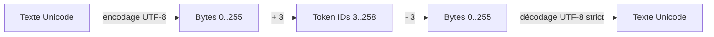
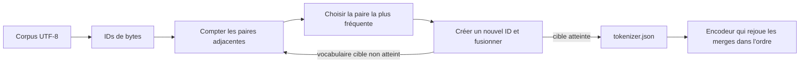

# Tokenization : des caractères aux pièces BPE

## Qu'est-ce que c'est?

Un modèle ne reçoit pas directement du texte. Un tokenizer transforme le texte en une séquence d'entiers appelés **token IDs**. PR02 commence par le tokenizer le plus universel et le plus facile à inspecter : un token représente exactement un byte UTF-8.



## Pourquoi en avons-nous besoin?

Les couches neuronales manipulent des nombres. Les token IDs serviront plus tard d'indices dans la matrice d'embeddings. Le byte tokenizer fournit dès maintenant trois propriétés importantes :

- tout texte UTF-8 valide peut être encodé;
- la table de correspondance est fixe et entièrement explicable;
- aucun token `<unk>` n'est nécessaire, car tout fichier UTF-8 est une suite de bytes parmi les 256 valeurs possibles.

Il est moins compact qu'un tokenizer BPE. PR03 apprendra justement à fusionner des suites de bytes fréquentes afin de réduire le nombre de tokens.

## Quelle est la formule?

Nous réservons les trois premiers IDs :

```text
PAD = 0
BOS = 1
EOS = 2
```

Chaque byte non signé `b` compris entre 0 et 255 utilise ensuite :

```text
tokenId = b + 3
b = tokenId - 3
```

Le vocabulaire contient donc `3 + 256 = 259` IDs. Par exemple, `A` vaut 65 en UTF-8 et devient le token ID 68.

## Caractère, code point, byte et token

Ces notions ne sont pas interchangeables. Un caractère visible peut demander plusieurs bytes UTF-8 :

| Texte | Bytes UTF-8            | Token IDs              |
|-------|------------------------|------------------------|
| `A`   | `[65]`                 | `[68]`                 |
| `é`   | `[195, 169]`           | `[198, 172]`           |
| `👋`  | `[240, 159, 145, 139]` | `[243, 162, 148, 142]` |

Ainsi, le byte tokenizer produit un token par byte, pas un token par lettre ni par caractère affiché.

## Quelles sont les dimensions?

PR02 ne crée toujours aucun tenseur. Pour un texte encodé en `T` bytes :

```text
texte                 String
bytes UTF-8           ByteArray[T]
token IDs             IntArray[T]
token IDs avec BOS/EOS IntArray[T + 2]
```

Plus tard, un batch de séquences aura une forme `[B, T]`. `PAD` permettra d'aligner des séquences de longueurs différentes, mais PR02 n'effectue pas encore de batching.

## À quoi servent les tokens spéciaux?

- `BOS` marque explicitement le début d'une séquence;
- `EOS` marque sa fin et permettra à la génération de savoir quand s'arrêter;
- `PAD` remplira plus tard les positions inutilisées d'un batch.

Ils sont optionnels lors de l'encodage. Le décodage normal les ignore afin de reconstruire seulement le texte original.

## Pourquoi le décodage UTF-8 est-il strict?

Tous les bytes sont représentables individuellement, mais toute suite arbitraire de bytes ne forme pas nécessairement un texte UTF-8 valide. Par exemple, le byte `195` annonce le début d'une séquence de deux bytes; seul, il est incomplet.

`decodeToBytes()` peut toujours reconstruire les bytes. `decode()` exige qu'ils forment un texte UTF-8 valide et signale sinon une erreur. Cette distinction évite une corruption silencieuse par un caractère de remplacement.

## Où est-ce implémenté?

- `ByteTokenizer.kt` contient les formules encode/decode;
- `SpecialToken.kt` définit `PAD`, `BOS` et `EOS`;
- `ByteTokenizerArtifactStore.kt` sauvegarde et valide `tokenizer.json`;
- `ByteTokenizerCommands.kt` rend le mécanisme observable depuis la CLI.

## Quels tests prouvent que cela fonctionne?

`ByteTokenizerTest` couvre ASCII, français, emoji, caractères asiatiques, Unicode combiné, espaces, newlines, texte vide, les 256 bytes, les tokens spéciaux et les erreurs UTF-8. `ByteTokenizerArtifactStoreTest` protège le format versionné et `ByteTokenizerCommandsTest` vérifie les commandes exécutables.

Le test des 256 valeurs est la preuve essentielle qu'aucun byte inconnu ne peut apparaître.

## Qu'est-ce qui casse si cette partie est incorrecte?

- un décalage incorrect change le sens de tous les IDs;
- un encode/decode non symétrique corrompt le corpus et les générations;
- une collision avec `PAD/BOS/EOS` rend les séquences ambiguës;
- une sérialisation non versionnée peut associer un checkpoint au mauvais vocabulaire;
- un traitement par caractères au lieu de bytes échoue sur les accents ou emoji.

## Expérience à faire

Suis la [note de laboratoire PR02](lab-notes/pr-02-byte-tokenizer.md). Elle montre comment inspecter plusieurs écritures, ajouter les tokens spéciaux, créer l'artefact JSON et exécuter uniquement les tests du tokenizer.

## PR03 : que change le byte-level BPE?

Le BPE ne remplace pas la couverture universelle de PR02. Il commence avec exactement les mêmes 259 IDs, puis apprend des tokens supplémentaires en fusionnant les paires adjacentes les plus fréquentes du corpus d'entraînement.



Avec le texte `abab`, les IDs initiaux de `a` et `b` sont 100 et 101. Le premier merge devient `(100, 101) -> 259`, soit la pièce `ab`. Après remplacement, `[100, 101, 100, 101]` devient `[259, 259]`; le merge suivant peut donc créer `(259, 259) -> 260`, soit `abab`.

### Pourquoi choisir la paire la plus fréquente?

Une paire fréquente remplacée par un seul ID réduit souvent la longueur des séquences. Des séquences plus courtes diminuent le nombre de positions traitées par le futur Transformer. Le choix est toutefois local et glouton : BPE optimise la compression des motifs observés, pas directement la compréhension du langage.

### Pourquoi imposer un départage déterministe?

Plusieurs paires ont souvent la même fréquence. Nous choisissons alors la plus petite paire selon `(leftId, rightId)`. Le parcours d'une `HashMap` ne peut donc pas modifier le résultat : mêmes bytes et même taille cible produisent les mêmes merges et le même checksum de corpus.

### Pourquoi les remplacements ne se chevauchent-ils pas?

Pour `aaa`, la paire `aa` apparaît à deux positions qui partagent le byte central. Un token ne peut participer qu'à une fusion durant un passage. Le remplacement gauche-vers-droite produit donc `[aa, a]`, jamais deux pièces `aa` qui réutiliseraient le même byte.

### Pourquoi l'ordre des merges fait-il partie du modèle?

Un merge récent peut référencer un token créé par un merge précédent. À l'encodage, il faut donc rejouer les règles dans leur ordre d'apprentissage. Trier les règles par fréquence ou par ID après l'entraînement changerait la tokenization.

### Que contient l'artefact?

`tokenizer.json` enregistre explicitement la version, les tokens spéciaux, les bytes de chaque entrée, les merges ordonnés, leur fréquence d'apprentissage, la taille du corpus et son SHA-256. Le chargement refuse les champs inconnus, les IDs non contigus et les pièces incompatibles avec leurs merges. Un checkpoint futur devra conserver exactement cet artefact.

### Quel est le coût de cette implémentation?

Le trainer de PR03 privilégie la lisibilité : il conserve le corpus tokenisé en mémoire et recompte toutes les paires après chaque merge. Pour `N` tokens et `M = vocabSize - 259` merges, son ordre de grandeur est `O(M × N)` en temps et `O(N)` en mémoire. C'est adapté au laboratoire et à des corpus modestes, mais il faudra mesurer puis optimiser les comptes incrémentaux avant un très gros corpus.

Suis la [note de laboratoire PR03](lab-notes/pr-03-byte-level-bpe.md) pour entraîner un artefact, inspecter ses pièces et comparer le nombre de bytes par token.
