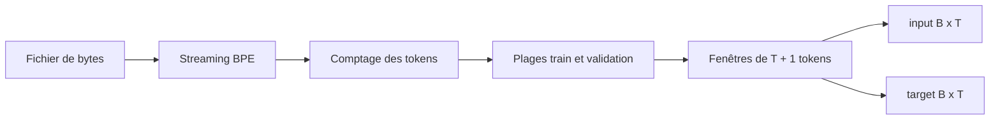
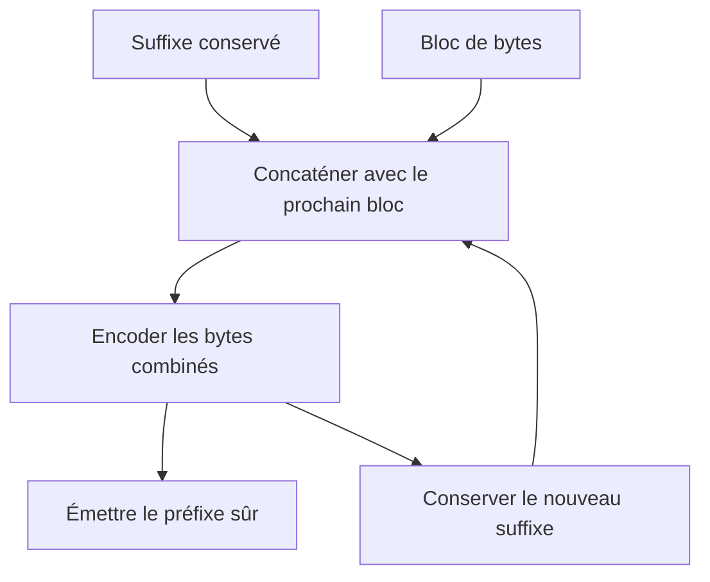

# Dataset : du flux de tokens aux batches

## Quel problème PR04 résout-elle?

Le tokenizer produit un flux d'IDs, mais le futur modèle attend des matrices de forme `[B,T]`. PR04 transforme un fichier local en exemples de prédiction du prochain token sans charger tout le corpus en mémoire.



## Pourquoi une fenêtre contient-elle `T+1` tokens?

Pour apprendre à prédire le token suivant, une fenêtre `s` de longueur `T+1` devient deux séquences de longueur `T` :

```text
s      = [10, 20, 30, 40, 50]
input  = [10, 20, 30, 40]
target = [20, 30, 40, 50]
```

À chaque position `t`, la cible vaut donc `input[t+1]`. Un batch de `B` fenêtres produit deux tableaux primitifs aplatis de `B × T` entiers. Ils seront convertis en tenseurs `[B,T]` seulement lors de l'intégration DJL.

## Comment le BPE reste-t-il exact en streaming?

Encoder indépendamment chaque bloc de bytes serait faux : une pièce apprise peut traverser la frontière de deux blocs. Le lecteur conserve un suffixe au moins aussi long que la plus longue pièce du vocabulaire, réencode ce petit suffixe avec le prochain bloc, puis n'émet que le préfixe qui ne peut plus être modifié.



Les tests coupent le même corpus après chaque nombre possible de bytes, y compris au milieu de l'UTF-8, et comparent le résultat à l'encodage complet.

## Pourquoi deux passages sur le corpus?

Le premier passage compte les tokens sans les conserver. Ce total fixe une frontière de split exacte. Le second passage ouvre un nouveau lecteur, saute jusqu'à la plage choisie et produit les fenêtres.

Cette décision échange du temps de lecture contre une mémoire bornée et un split explicable. Une indexation persistante pourrait accélérer les époques futures, mais elle ajouterait dès maintenant un format dérivé à versionner.

## Comment le split évite-t-il la fuite?

Pour `N` tokens et une fraction de validation `f` :

```text
validationCount = floor(N × f)
boundary        = N - validationCount
train           = [0, boundary)
validation      = [boundary, N)
```

Les fenêtres sont construites après le split et restent entièrement dans leur plage. Aucun token n'appartient aux deux ensembles. Nous retenons un split contigu parce qu'il est simple, reproductible et compatible avec le streaming; il peut toutefois révéler une dérive temporelle si le début et la fin du corpus diffèrent fortement.

Le tokenizer BPE doit avoir été entraîné uniquement sur le corpus train préparé. PR04 ne réentraîne jamais ses merges avec la validation. Ici, « sans fuite » garantit précisément que les plages et fenêtres ne partagent aucun token; la provenance du tokenizer reste une responsabilité distincte du pipeline de préparation.

## Pourquoi le stride par défaut vaut-il `T`?

Une fenêtre utilise `T+1` tokens. Avec un stride de `T`, deux fenêtres voisines partagent seulement le token qui sert de dernière cible à la première et de premier contexte à la seconde :

```text
fenêtre 1 : [s0 ... sT]
fenêtre 2 :             [sT ... s2T]
```

Toutes les transitions next-token sont ainsi observées sans dupliquer des contextes complets. Un stride inférieur crée davantage de fenêtres qui se chevauchent; un stride supérieur saute certaines transitions.

## Que devient le dernier fragment?

Seules les fenêtres complètes de `T+1` tokens sont émises. Les tokens restants sont annoncés comme `Trailing tokens`; ils ne sont ni complétés avec `PAD`, ni transformés en exemple de taille différente. Le dernier batch peut être plus petit que `B`, sauf avec `--drop-last-batch`.

## Comment fonctionne le shuffle?

Un shuffle global demanderait de matérialiser ou d'indexer toutes les fenêtres. PR04 remplit plutôt un buffer borné, choisit une fenêtre avec `java.util.Random(seed)`, puis la remplace par la prochaine fenêtre du flux. Le même corpus, le même tokenizer, le même buffer et la même seed donnent le même ordre.

Ce shuffle est local et non une permutation globale uniforme. Augmenter `--shuffle-buffer` améliore le mélange au prix d'environ `bufferSize × (T+1) × 4` bytes pour les IDs, plus les petits objets du buffer.

## Quelle mémoire est utilisée?

La mémoire ne dépend pas directement de la taille du fichier :

```text
stream BPE     O(byteChunkSize + longueur maximale d'une pièce)
fenêtre        O(T)
shuffle        O(shuffleBufferSize × T)
batch          O(B × T)
```

Le corpus complet et la liste complète des fenêtres ne sont jamais conservés. Le temps reste proportionnel aux tokens parcourus et le comptage impose un passage supplémentaire.

## Limites assumées

- Le corpus est un flux continu; PR04 ne connaît pas encore les frontières logiques de documents.
- Le split contigu privilégie l'absence de fuite et la lisibilité, pas la stratification.
- Chaque nouvelle époque relit et retokenise le fichier; aucun cache d'IDs n'est encore créé.
- Le batch contient des `IntArray`; les tenseurs et appareils arrivent avec DJL en PR05.

La [note de laboratoire PR04](lab-notes/pr-04-dataset-and-sequences.md) fournit les commandes et les résultats mesurés.
