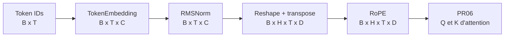
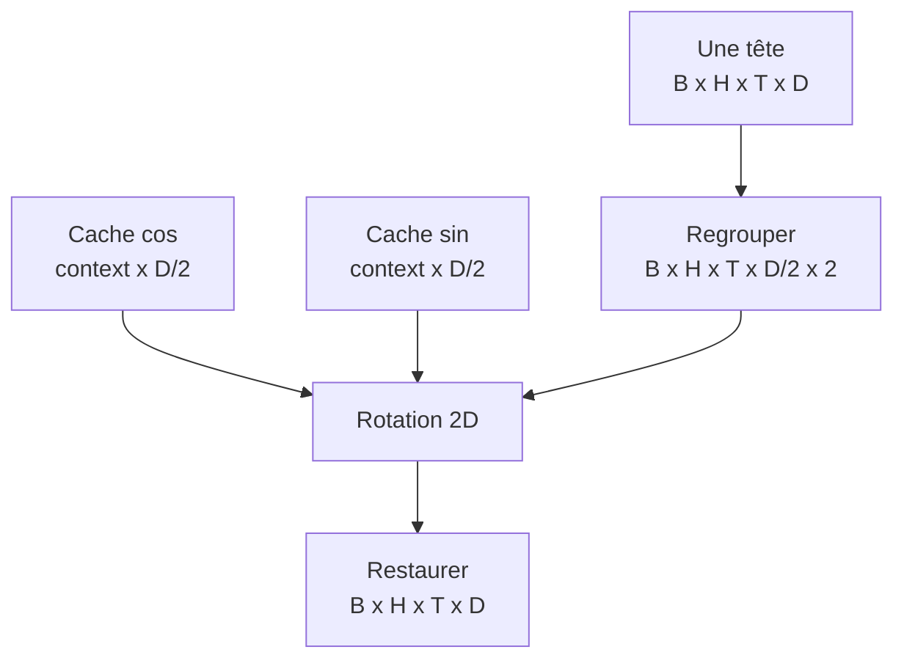

# Embeddings, RMSNorm et RoPE

## Où sommes-nous dans le modèle?

PR05 introduit les premières opérations différentiables. Elle ne construit pas encore l'attention : RoPE prépare seulement le format et la rotation que PR06 appliquera à `Q` et `K`.



Notation : `B` est la taille du batch, `T` la séquence, `V` le vocabulaire, `C=dModel`, `H` le nombre de têtes et `D=C/H`.

## TokenEmbedding

La table apprise possède la forme `[V,C]`. Pour chaque ID, l'opération sélectionne la ligne correspondante :

```text
ids                         [B,T]
embedding weight W          [V,C]
W[ids]                      [B,T,C]
nombre de paramètres        V × C
```

Le lookup est une indexation, pas une multiplication one-hot. Une représentation one-hot intermédiaire `[B,T,V]` gaspillerait beaucoup de mémoire. Lors du backward, seules les lignes utilisées reçoivent un gradient; si un ID apparaît deux fois, ses contributions s'additionnent.

Les poids sont initialisés par une normale d'écart-type `0,02`. Cette convention est un point de départ; l'initialisation complète du Transformer sera décidée avec le modèle en PR08.

## RMSNorm

Pour un vecteur `x` de `C` composantes :

```text
meanSquare = (1/C) × somme(x_i²)
rms        = sqrt(meanSquare + epsilon)
y_i        = gamma_i × x_i / rms
```

`gamma` est un vecteur appris `[C]`, initialisé à 1. RMSNorm conserve donc la forme et ajoute exactement `C` paramètres.

Contrairement à LayerNorm, RMSNorm ne soustrait pas la moyenne et n'apprend pas de biais `beta`. Nous la retenons parce qu'elle correspond à l'architecture cible, réduit les opérations et reste simple à vérifier manuellement. Elle normalise l'échelle quadratique, pas nécessairement la moyenne du signal.

`epsilon=1e-5` empêche une division par zéro et améliore la stabilité près d'un vecteur nul.

## RoPE

RoPE regroupe les dimensions d'une tête par paires adjacentes. Pour la paire `(x_0,x_1)` à la position `p` et à la fréquence `i` :

```text
inverseFrequency_i = theta ^ (-2i / D)
angle               = p × inverseFrequency_i
y_0                 = x_0 cos(angle) - x_1 sin(angle)
y_1                 = x_0 sin(angle) + x_1 cos(angle)
```

La même formule s'applique à chaque paire. Une rotation conserve la norme euclidienne de la paire. À `p=0`, l'angle vaut zéro : `cos(0)=1`, `sin(0)=0`, donc le vecteur reste inchangé.



Les caches sinus/cosinus ne sont pas des paramètres : ils sont déterminés entièrement par `position`, `theta` et `D`, ne demandent aucun gradient et vivent dans un sous-`NDManager`. Allonger le contexte agrandit ces caches et les activations futures, mais n'ajoute aucun poids appris.

`D` doit être pair. Pour `C=384` et `H=6`, `D=64`, soit 32 paires par tête.

## Gradients

DJL construit le graphe d'autograd pendant le forward effectué sous un `GradientCollector`. Le backward de la somme des sorties démontre :

- un gradient sur les lignes utilisées de la table d'embedding;
- un gradient sur `gamma` de RMSNorm;
- un gradient qui traverse RoPE vers son entrée;
- aucun gradient ni paramètre RoPE à optimiser.

Cette preuve vérifie la connectivité du graphe. Elle ne remplace pas encore une loss next-token ni un optimizer, qui arrivent en PR09.

## Pourquoi rester dépendant de l'API DJL?

Le code importe `ai.djl:api`, jamais les classes internes du moteur PyTorch. `pytorch-engine` est une dépendance runtime. Ce découplage garde les blocs lisibles et évite qu'une primitive du modèle dépende directement de JNI ou d'une classe spécifique à PyTorch.

DJL `0.36.0` et PyTorch `2.7.1` sont les versions observées dans le laboratoire. Au premier lancement, le moteur peut télécharger ses natives adaptées à la plateforme. Une exécution hors ligne doit fournir les artefacts natifs explicitement.

## Ressources natives

Un objet Kotlin peut devenir inaccessible sans que sa mémoire native soit immédiatement libérée. Tous les managers, sous-managers, blocs et collecteurs doivent donc suivre une portée déterministe. Consulte [Gestion de la mémoire native DJL](architecture/djl-memory-management.md).

## Limites de PR05

- Les composants sont isolés; aucun bloc Transformer n'existe encore.
- La commande PR05 applique RoPE à une représentation de démonstration; la [self-attention de PR06](06-causal-self-attention.md) l'applique réellement à `Q` et `K`.
- Le chemin validé automatiquement est CPU FP32.
- Mixed precision, GPU et initialisation complète sont reportés après une référence correcte.

La [note de laboratoire PR05](lab-notes/pr-05-embeddings-rmsnorm-rope.md) permet de reproduire chaque observation.
