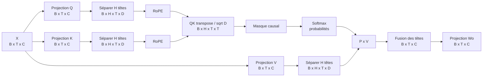
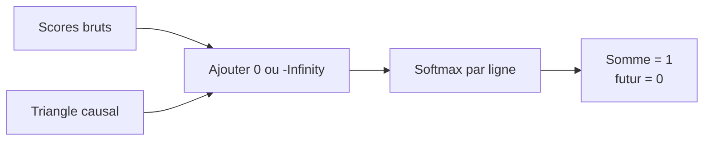

# Self-attention causale

## Position dans le modèle

PR06 transforme les états normalisés en un mélange pondéré des états présents et passés. Elle ne crée pas encore la connexion résiduelle ni le feed-forward de PR07.



`B` est le batch, `T` la longueur de séquence, `C=dModel`, `H=numHeads` et `D=C/H`. `C` doit être divisible par `H`; `D` doit aussi être pair pour les rotations RoPE par paires.

## Les quatre projections

À partir du même état `X`, nous apprenons trois rôles :

```text
Q = X Wq    ce que chaque position recherche
K = X Wk    ce que chaque position permet de comparer
V = X Wv    le contenu transmis si la comparaison est forte
Y = contexte Wo
```

Chaque poids a la forme `[C,C]` et aucun biais. La projection de sortie remélange l'information des têtes. Le total est `4 × C × C`, indépendant du nombre de têtes tant que `C` ne change pas.

## Scores et mise à l'échelle

Après séparation des têtes et RoPE sur Q/K :

```text
scores[b,h,i,j] = dot(Q[b,h,i,:], K[b,h,j,:]) / sqrt(D)
```

Sans division par `sqrt(D)`, la variance des produits scalaires tend à augmenter avec `D`. Le softmax peut alors devenir très pointu et produire des gradients moins confortables dès l'initialisation.

## Masque causal

Pour une séquence de quatre tokens, le masque autorisé est triangulaire inférieur :

```text
          clé 0  clé 1  clé 2  clé 3
requête 0   oui    non    non    non
requête 1   oui    oui    non    non
requête 2   oui    oui    oui    non
requête 3   oui    oui    oui    oui
```

Nous ajoutons `-Infinity` aux cases interdites avant softmax. Leur exponentielle devient zéro; chaque ligne conserve une somme de 1 sur les clés autorisées.



Le premier token ne peut lire que lui-même. Le dernier peut lire toute la séquence disponible. Cela ne signifie pas que le modèle connaît le futur lors de la génération : le dernier token est précisément la position courante.

## Preuve anti-fuite

Une matrice visuellement triangulaire est utile, mais le test comportemental est plus fort :

1. calculer les sorties pour `[x0,x1,x2,x3]`;
2. remplacer seulement `x3` par une valeur très différente;
3. recalculer avec les mêmes poids;
4. vérifier que les sorties 0, 1 et 2 sont strictement identiques.

La sortie 3 peut changer, puisqu'elle est autorisée à lire la clé 3. Si une sortie passée changeait, le modèle pourrait tricher pendant l'entraînement next-token.

## Coût

Les projections coûtent approximativement `O(BTC²)`. Les scores et l'agrégation coûtent `O(BHT²D)`, équivalent à `O(BT²C)`. La matrice de probabilités contient `B × H × T × T` nombres : doubler `T` multiplie cette partie de la mémoire et du calcul par environ quatre.

Le masque créé pendant le forward est une ressource temporaire gérée par le manager de l'entrée. Le cache sinus/cosinus RoPE appartient toujours à un sous-manager fermé avec le bloc d'attention.

## Limites de PR06

- La commande PR06 inspecte l'attention seule; le [bloc de PR07](07-transformer-block.md) ajoute résidus, RMSNorm et SwiGLU.
- Pas de dropout d'attention; la référence reste déterministe.
- Pas de KV cache pour la génération incrémentale.
- Pas de padding mask, car les fenêtres PR04 sont actuellement pleines ou explicitement fragmentées.
- Pas de Flash Attention, GQA ou kernel spécifique à PyTorch.

La décision complète est consignée dans [ADR 0001](architecture/decisions/0001-standard-causal-mha.md) et les commandes se trouvent dans la [note de laboratoire PR06](lab-notes/pr-06-causal-self-attention.md).
