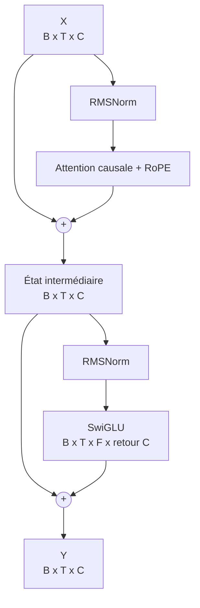
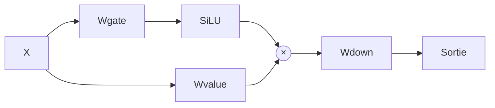
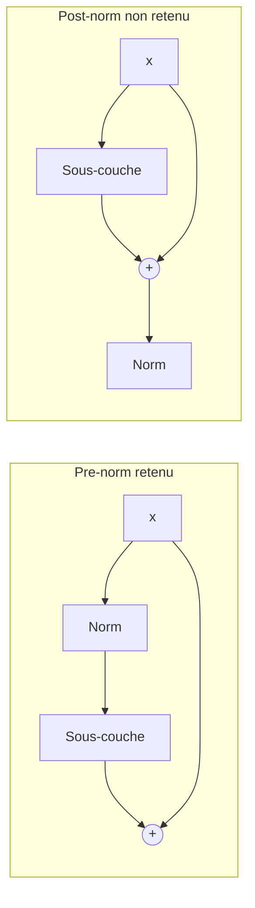

# SwiGLU et bloc Transformer pre-norm

## Le bloc complet

PR07 assemble les primitives précédentes dans la plus petite unité répétable du futur modèle. L'entrée et la sortie gardent la forme `[B,T,C]`.



La normalisation arrive avant chaque sous-couche, d'où le nom **pre-norm**. La connexion horizontale contourne la sous-couche et additionne son résultat à l'état existant.

## SwiGLU étape par étape

Pour `X [B,T,C]` et une dimension cachée `F` :

```text
gate          = X Wgate              [B,T,F]
value         = X Wvalue             [B,T,F]
activatedGate = SiLU(gate)           [B,T,F]
hidden        = activatedGate × value [B,T,F]
output        = hidden Wdown          [B,T,C]
```

La multiplication entre `activatedGate` et `value` est élément par élément. SiLU, aussi appelée Swish avec coefficient 1, vaut :

```text
sigmoid(z) = 1 / (1 + exp(-z))
SiLU(z)    = z × sigmoid(z)
```

La branche gate décide progressivement quelles composantes de la branche value sont transmises. Contrairement à ReLU, SiLU est lisse et peut conserver une petite valeur négative.



## Résidus et gradients

Pour la première sous-couche :

```text
a = x + f(RMSNorm(x))
```

La dérivée par rapport à `x` contient une contribution identité en plus de la dérivée de la branche apprise :

```text
da/dx = I + d(f(RMSNorm(x)))/dx
```

Ce chemin aide l'information et les gradients à traverser plusieurs blocs. Il ne garantit toutefois pas que la norme finale du gradient soit toujours plus grande : deux contributions vectorielles peuvent se renforcer, être orthogonales ou s'annuler partiellement.

Le forward normal de `TransformerBlock` active toujours les deux résidus. `forwardForInspection` permet seulement au laboratoire de les retirer temporairement avec les mêmes poids afin d'observer la différence.

## Pre-norm contre post-norm



Les deux architectures existent. Nous retenons pre-norm parce que le chemin résiduel identité reste directement visible et parce qu'il correspond à l'architecture cible annoncée depuis PR01.

## Paramètres

Un bloc contient :

| Composant | Formule |
|---|---:|
| Attention Q/K/V/O | `4C²` |
| SwiGLU gate/value/down | `3CF` |
| Deux RMSNorm | `2C` |
| **Total** | **`4C² + 3CF + 2C`** |

Pour le laboratoire `C=8`, `F=16`, le total vaut `256 + 384 + 16 = 656`. Pour le preset 17 M, `C=384`, `F=1024`, un bloc vaut `1 770 240` paramètres.

## Causalité conservée

RMSNorm et SwiGLU travaillent indépendamment à chaque position : ils mélangent les dimensions de `C`, jamais les positions de `T`. Les additions résiduelles réunissent des tenseurs à la même position. L'attention demeure donc le seul endroit qui mélange les tokens, et son masque PR06 protège encore le passé.

Le test anti-fuite est répété au niveau du bloc complet. Cela protège contre une erreur future de reshape ou d'assemblage, même si le test isolé de l'attention reste vert.

## Limites de PR07

- La commande PR07 exécute un seul bloc; le [modèle PR08](08-decoder-language-model.md) construit la pile de `N` blocs.
- Embedding et LM head sont volontairement absents de l'expérience isolée PR07.
- Aucun logit ou calcul de loss n'existe encore.
- Dropout, mixed precision et optimisation des kernels restent hors de la référence.

La décision est consignée dans [ADR 0002](architecture/decisions/0002-prenorm-swiglu-block.md). Les expériences reproductibles sont dans la [note de laboratoire PR07](lab-notes/pr-07-transformer-block.md).
