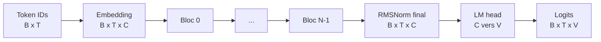
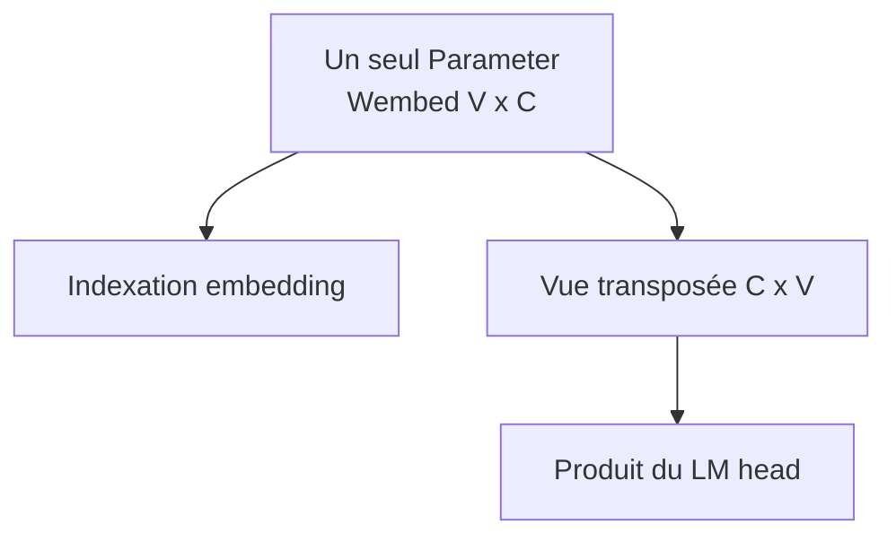

# Modèle decoder-only et logits

## Du token au vocabulaire

PR08 assemble pour la première fois tout le forward neuronal. Une entrée d'IDs `[B,T]` devient un score pour chaque token du vocabulaire à chaque position.



Chaque bloc conserve `[B,T,C]`. Seuls l'embedding ajoute l'axe `C` et le head remplace `C` par `V`.

## Que sont les logits?

Un logit est un score réel non normalisé. Pour un état final `h[b,t,:]`, le head calcule :

```text
logits[b,t,:] = h[b,t,:] × Whead
```

La forme vaut `[B,T,V]`. Un score plus grand indique une préférence relative, mais les logits ne somment pas à 1 et peuvent être négatifs. PR09 donnera ces logits directement à la cross-entropy, qui combine mathématiquement log-softmax et sélection de la cible de façon stable.

Ajouter un softmax ici serait prématuré : cela gaspillerait du calcul pendant l'entraînement et pourrait réduire la stabilité numérique de la loss.

## Weight tying

La table d'embedding possède la forme `[V,C]`. Un head indépendant attend `[C,V]`. En mode lié, nous utilisons simplement la vue transposée de la même matrice :

```text
embedding : ids -> Wembed[ids]      avec Wembed [V,C]
LM head   : hidden × Wembedᵀ        avec Wembedᵀ [C,V]
```



Le code teste l'identité avec `===` pour le `Parameter` et le `NDArray`. Il ne suffit pas que deux matrices aient les mêmes valeurs. Le head lié n'enregistre aucun poids direct, donc le modèle et l'optimizer ne voient le poids qu'une fois.

## Assemblage et paramètres

Le modèle enregistre :

```text
1 table embedding
N × 9 tenseurs par bloc
1 échelle RMSNorm finale
0 ou 1 matrice de head
```

Pour `mini-17m`, `N=8` :

```text
weight tying actif   : 1 + 8×9 + 1     = 74 tenseurs
weight tying inactif : 1 + 8×9 + 1 + 1 = 75 tenseurs
```

Le nombre de tenseurs n'est pas le nombre de poids : chaque tenseur contient de nombreuses valeurs. Le compte réel additionne `array.size()` pour tous les paramètres récursifs après initialisation.

| Mode | Paramètres réels | Différence |
|---|---:|---:|
| Lié | `17 308 032` | référence |
| Non lié | `20 453 760` | `+3 145 728 = V×C` |

## Causalité de bout en bout

Embedding, RMSNorm et head travaillent position par position. Les blocs sont causaux grâce au masque PR06. Par conséquent, changer le dernier ID ne doit modifier aucun logit des positions précédentes.

PR08 répète ce test au niveau `[B,T,V]`. Cette redondance protège contre une erreur d'assemblage dans la pile, la norme finale ou le head.

## Initialisation

La référence FP32 utilise :

- normale `std=0,02` pour embeddings et head indépendant;
- Xavier pour les projections attention et SwiGLU;
- 1 pour les échelles RMSNorm.

Le forward complet est fini et ses gradients sont finis dans les tests. Cela ne prouve pas encore que l'optimisation apprend correctement; le single-batch overfit de PR09 sera la prochaine porte de sortie.

## Ressources

Chaque bloc possède son cache RoPE. Un modèle de huit blocs ouvre donc huit sous-managers de cache. `DecoderLanguageModel.close()` tente de fermer tous les blocs même si un nettoyage antérieur échoue, puis le manager parent est fermé par l'appelant.

Les poids FP32 de `mini-17m` occupent seuls environ `69,2 MB` décimaux. Un entraînement demandera davantage pour gradients, activations et états AdamW.

## Limites à la sortie de PR08

- Les logits ne sont reliés à aucune cible et aucune loss n'est calculée.
- Aucun optimizer ni step d'entraînement n'existe encore.
- Le modèle ne sauvegarde pas encore ses poids.
- Dropout doit rester à `0.0` et mixed precision est reporté.
- Le forward de référence ne possède pas de KV cache de génération.

Ces deux premières limites sont maintenant levées par [PR09](09-loss-and-training-loop.md), qui ajoute loss et optimizer sans modifier le contrat du forward. La décision de partage est détaillée dans [ADR 0003](architecture/decisions/0003-weight-tying-and-initialization.md). Les commandes reproductibles sont dans la [note de laboratoire PR08](lab-notes/pr-08-decoder-language-model.md).
