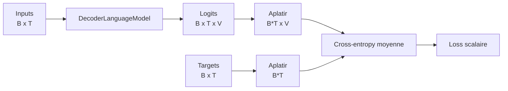
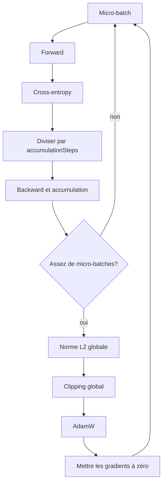
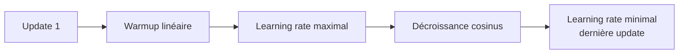

# Loss et boucle d'entraînement

## De la prédiction à une erreur mesurable

Le modèle reçoit `inputIds [B,T]` et produit `logits [B,T,V]`. La cible `targetIds [B,T]` contient le token suivant attendu à chaque position. Pour un token cible `y`, la cross-entropy vaut :

```text
loss = -log( exp(logit[y]) / somme_j exp(logit[j]) )
```

En pratique, DJL combine log-softmax et sélection de la cible dans une seule opération numériquement stable. Nous ne calculons donc jamais un softmax séparé. L'implémentation aplatit seulement les deux axes de tokens :

```text
logits [B,T,V] -> [B*T,V]
targets [B,T]  -> [B*T]
```

La moyenne porte ainsi sur les `B*T` prédictions. Aplatir ne mélange pas les exemples : la position `i` des targets correspond toujours à la ligne `i` des logits.



## Une update complète

Une micro-batch effectue forward, loss et backward. Plusieurs micro-batches peuvent accumuler leurs gradients avant une seule update AdamW.



Diviser chaque loss par `gradientAccumulationSteps` donne la moyenne des gradients accumulés plutôt que leur somme. Si le dernier groupe est incomplet, `finishAccumulation()` corrige son échelle avant l'update. Le batch effectif en séquences vaut :

```text
batch effectif = batchSize * gradientAccumulationSteps
```

## Clipping global

Nous calculons une seule norme sur tous les gradients entraînables :

```text
globalNorm = sqrt(somme_paramètres somme_éléments gradient²)
scale      = clipThreshold / globalNorm, si globalNorm > clipThreshold
```

Tous les gradients sont multipliés par le même `scale`. Leur direction collective est conservée. Un clipping indépendant élément par élément changerait cette direction et répondrait à une autre question.

La boucle refuse une loss ou une norme non finie. Elle remet les gradients à zéro après chaque update, et aussi avant de signaler une norme invalide, afin de ne pas contaminer une tentative suivante.

Les tenseurs temporaires `gradient²` et leur somme sont fermés pendant le calcul de norme. Sans cette fermeture, ils resteraient enregistrés dans le manager des poids jusqu'à la fin du run et la mémoire native augmenterait à chaque update.

## AdamW et learning rate

AdamW conserve pour chaque poids une moyenne mobile du gradient et de son carré. `beta1` contrôle le premier moment, `beta2` le second. Le weight decay est découplé de l'adaptation du gradient, contrairement à une pénalité L2 naïvement ajoutée à la loss.

Le learning rate suit deux phases :



Pendant le warmup, l'update `u` utilise `maxLearningRate * u / warmupUpdates`. La première update après le warmup est encore au maximum, puis le cosinus atteint exactement le minimum à la dernière update. Les numéros affichés sont basés sur 1, comme le compteur transmis par l'optimizer DJL. PR10 a ajouté un test d'intégration de ce contrat et corrigé l'adapter qui avançait auparavant le taux interne d'une update.

## Pourquoi cette implémentation

- La loss explicite rend les formes et la moyenne par token inspectables.
- La boucle manuelle rend visible l'ordre backward, clipping, optimizer et remise à zéro.
- AdamW reste fourni par DJL pour ne pas réimplémenter incorrectement ses états et corrections de biais.
- Le clipping global est implémenté ici, car le clipping configurable de l'optimizer DJL est élément par élément.
- Les métriques sont retournées comme valeurs Kotlin, puis la CLI décide comment les afficher.

Cette frontière garde le code pédagogique sans remplacer les primitives numériques fiables du backend.

## Portée de PR09

PR09 prouve qu'un tiny model peut mémoriser un lot. Elle ne relie pas encore la boucle au corpus streamé de PR04 et ne calcule pas de validation loss. PR10 ajoute les checkpoints de poids avec une reprise explicitement limitée; la génération arrive en PR11; le premier entraînement de corpus mesuré et l'évaluation arrivent en PR12.

La décision est consignée dans [ADR 0004](architecture/decisions/0004-explicit-adamw-training-loop.md). Les commandes et expériences sont dans la [note de laboratoire PR09](lab-notes/pr-09-single-batch-overfit.md).
