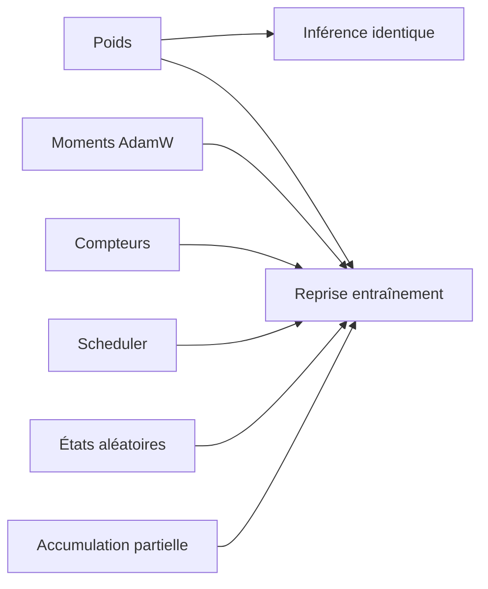
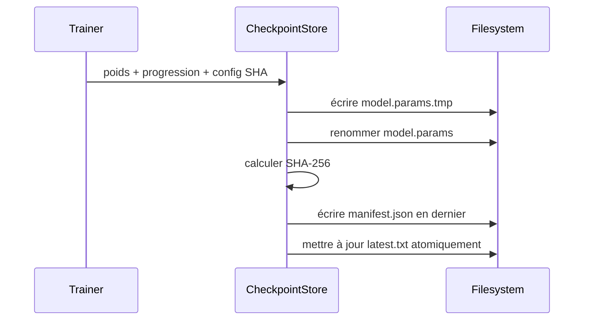
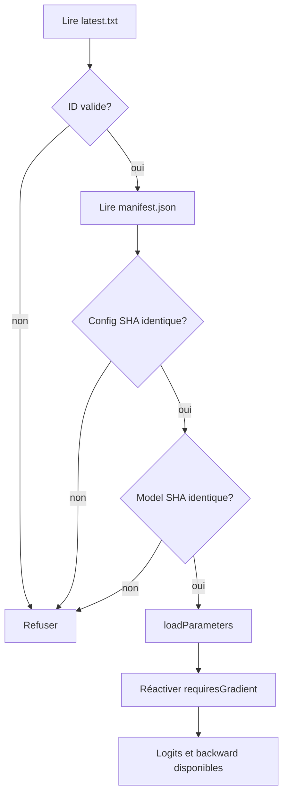

# Checkpoints et runs reproductibles

## Deux promesses différentes

Un checkpoint peut répondre à deux besoins :

1. **Restaurer le modèle :** recréer exactement les poids et obtenir les mêmes logits.
2. **Reprendre l'entraînement exactement :** produire la même prochaine update que si le processus n'avait jamais été interrompu.

La seconde promesse exige davantage que les poids. Pour AdamW, il faut aussi les deux moments de chaque paramètre, les compteurs de correction de biais, le scheduler, les gradients accumulés éventuels et les états aléatoires.



PR10 prouve la première promesse. Elle restaure aussi la progression et le scheduler, mais indique `exactTrainingResume=false`, car DJL 0.36 ne fournit pas d'API publique pour sérialiser les moments internes de son AdamW et le backend RNG n'est pas sauvegardé.

## Arborescence d'un run

```text
run/
|-- config.yaml
|-- run-metadata.json
|-- metrics.jsonl
|-- checkpoints/
|   |-- latest.txt
|   |-- step-00000010/
|   |   |-- model.params
|   |   `-- manifest.json
|   `-- step-00000015/
|       |-- model.params
|       `-- manifest.json
`-- samples/
```

- `config.yaml` est la copie exacte de la configuration utilisée.
- `run-metadata.json` fixe moteur, device, seed, checksum des données synthétiques et limites de reprise.
- `metrics.jsonl` contient un objet JSON indépendant par update.
- `model.params` utilise `Block.saveParameters` de DJL.
- `manifest.json` versionne le format, lie poids et configuration par SHA-256 et décrit l'état restauré.
- `latest.txt` contient un identifiant contrôlé comme `step-00000015`; ce n'est pas un chemin arbitraire.
- `samples/` réserve l'emplacement des futures générations de PR11.

Le laboratoire PR10 utilise des IDs synthétiques, donc aucun tokenizer n'est requis. Un futur vrai run devra copier son `tokenizer.json` et son checksum dans le run.

## Sauvegarde fiable



Chaque fichier temporaire est renommé sur le même système de fichiers. Le manifeste arrive après les poids : son absence signifie que le checkpoint n'est pas complet. Le pointeur `latest.txt` n'est mis à jour qu'après le manifeste.

PR10 refuse d'écraser un checkpoint ou de commencer un run dans un dossier non vide. Ce choix évite de mélanger silencieusement deux expériences. Pour relancer, choisir un nouveau nom de run.

## Chargement fermé

Le chargement vérifie avant d'utiliser les poids :

- version et champs inconnus du manifeste;
- identifiant identique au nom du dossier;
- checksum de la configuration copiée;
- présence et SHA-256 de `model.params`;
- cohérence de la progression et du total d'updates;
- drapeaux de reprise compatibles avec le format 1;
- absence de données binaires supplémentaires après les paramètres.



DJL restaure les valeurs des paramètres, mais les tableaux chargés ne demandent pas automatiquement de gradient. Le store réapplique donc `Parameter.requiresGradient()` à chaque `NDArray`; un test exécute un vrai backward après chargement.

## État réellement restauré

| État | Format PR10 | Conséquence |
|---|---:|---|
| Poids du modèle | oui | logits bit-à-bit identiques sur le même moteur |
| Update et tokens vus | oui | métriques et progression continuent |
| Position warmup/cosine | oui | prochain learning rate correct |
| Compteur AdamW | oui | correction de biais reprend au bon numéro |
| Moments AdamW `m` et `v` | non | prochaine update différente d'un run ininterrompu |
| État RNG backend | non | dropout ou sampling futurs pourraient diverger |
| Gradients partiellement accumulés | non | checkpoint autorisé seulement entre les updates |

DJL expose `optBeginNumUpdate`, utilisé pour le compteur, mais conserve les moments d'AdamW dans des structures privées sans contrat de sérialisation. Une réflexion Java sur ces champs serait fragile et dépendrait d'un détail interne. Nous préférons une limite visible à une fausse reprise exacte.

## Reproductibilité et intégrité

Un SHA-256 détecte une modification accidentelle ou une mauvaise association entre artefacts. Il ne prouve ni la qualité des données ni l'identité de leur auteur, et n'est pas une signature cryptographique du run.

La reproductibilité exige aussi de conserver versions du moteur, device, seed et données. Deux environnements numériques différents peuvent produire de petits écarts même avec les mêmes artefacts. La garantie testée ici porte sur un chargement dans le même environnement DJL/PyTorch.

Les API de paramètres utilisées sont celles du [`Block` DJL 0.36](https://javadoc.io/static/ai.djl/api/0.36.0/ai/djl/nn/Block.html). L'API publique [`AdamW`](https://javadoc.io/static/ai.djl/api/0.36.0/ai/djl/training/optimizer/AdamW.html) expose l'update et son builder, mais aucune sauvegarde des moments.

## Portée de PR10

PR10 ne fournit pas encore un entraînement de corpus général, une reprise multi-processus exacte ni une politique de rétention des checkpoints. PR11 utilisera les poids restaurés pour générer; PR12 ajoutera validation et vrais runs mesurés.

La décision est consignée dans [ADR 0005](architecture/decisions/0005-versioned-weights-checkpoint.md). Les commandes et expériences sont dans la [note de laboratoire PR10](lab-notes/pr-10-checkpoint-round-trip.md).
