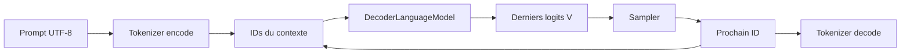
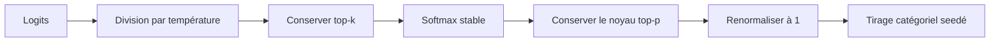

# Génération autorégressive et sampling

## Des logits au prochain token

Pour un contexte de `T` tokens, le modèle retourne des logits de forme `[1,T,V]`. Seul le vecteur de la dernière position, de forme `[V]`, prédit ce qui vient après tout le contexte disponible. Un logit est un score non normalisé : il peut être négatif et sa somme n'a aucune signification probabiliste.



La boucle répète ce chemin jusqu'à `maxNewTokens` ou jusqu'à EOS. Les IDs du prompt et tous les IDs générés sont conservés pour le texte final; seule l'entrée du prochain forward est tronquée à `contextLength`.

## Greedy

Greedy choisit directement :

```text
token = argmax_i(logit[i])
```

Il est déterministe, n'utilise pas la seed et tranche une égalité en faveur du plus petit ID. La probabilité `1.0` affichée par la trace greedy décrit la décision certaine du sélecteur, pas la probabilité softmax du modèle.

Greedy est excellent pour vérifier un motif appris. Il ne permet toutefois aucun choix alternatif et peut amplifier une répétition.

## Température et softmax stable

En sampling, chaque logit `z_i` est divisé par une température `tau > 0` :

```text
score_i = z_i / tau
p_i = exp(score_i - max(score)) / somme_j exp(score_j - max(score))
```

Soustraire le maximum ne change pas les probabilités, mais évite un dépassement numérique dans `exp`.

| Température | Effet |
|---:|---|
| `< 1` | écarts agrandis, distribution plus concentrée |
| `1` | softmax naturelle des logits |
| `> 1` | écarts réduits, distribution plus plate |

Une température nulle n'est pas une version de greedy et provoquerait une division par zéro. Utiliser explicitement `--strategy greedy`.

## Top-k et top-p

Top-k conserve seulement les `k` scores les plus élevés. `--top-k 0` le désactive.

Top-p, ou nucleus sampling, trie les probabilités décroissantes et garde le plus petit préfixe dont la somme atteint `p`. `--top-p 1.0` le désactive. Le candidat qui fait franchir le seuil reste inclus; sinon la masse conservée serait inférieure au seuil demandé.

PR11 combine les contrôles dans cet ordre :



Après top-p, les probabilités restantes sont renormalisées. La trace affiche ces probabilités finales, pas celles des candidats éliminés.

## Seed et reproductibilité

Le tirage catégoriel utilise `java.util.Random` initialisé par `--seed`. Même checkpoint, même tokenizer, même prompt, mêmes options et même seed donnent les mêmes IDs de sampling dans cette implémentation. Changer la seed peut ne rien changer si les filtres ne laissent qu'un candidat.

Cette garantie ne rend pas tout entraînement reproductible. Les poids, le moteur, le device et les opérations numériques doivent aussi être identiques pour recréer les mêmes logits.

## EOS et longueur maximale

EOS est l'ID spécial `2`. S'il est choisi, il est ajouté aux IDs générés puis la boucle s'arrête sans autre forward. `maxNewTokens` est une autre barrière : elle garantit la fin même si EOS n'est jamais choisi.

PAD et BOS ne sont pas interdits au sampling. Un modèle correctement entraîné doit apprendre quand les produire ou non; PR12 pourra introduire des politiques d'évaluation plus avancées.

## Fenêtre glissante et coût

PR11 n'a pas de KV cache. À chaque étape, le Transformer recalcule tout le suffixe disponible :

```text
coût approximatif d'une étape d'attention = O(T²)
mémoire des scores d'attention = O(T²)
```

Une fois `contextLength` atteint, le plus ancien ID est retiré de l'entrée du modèle. Le texte complet reste disponible pour l'affichage, mais ce token ancien ne peut plus influencer les choix suivants.

RoPE n'ajoute toujours aucun paramètre appris. Dans cette première fenêtre glissante, les positions du suffixe repartent cependant de zéro. Le tiny laboratoire montre qu'un motif peut diverger près de cette frontière : c'est une limite utile à observer, pas une preuve que le sampling est faux.

## Contrat du tokenizer

`generate` charge les artifacts `byte` et `byte-bpe`. Sa taille de vocabulaire doit être exactement celle de `run/config.yaml`; autrement la commande refuse le run. Le checkpoint ne contient pas encore le checksum du tokenizer, donc l'utilisateur doit toujours fournir `--tokenizer` explicitement.

Avec un BPE byte-level, une pièce isolée peut représenter seulement une partie d'un caractère UTF-8 et s'afficher comme caractère de remplacement. Le `Complete text`, décodé à partir de toute la séquence, est la référence fiable.

## Lecture d'une trace

```text
step=01 context=[100, 101, 102] chosen=35 piece=" " z=7.1234 p=0.982100 candidates=[...]
```

- `context` est exactement l'entrée du forward à cette étape;
- `z` est le logit choisi après division par température en sampling, brut en greedy;
- `p` est sa probabilité après tous les filtres; en greedy elle vaut conventionnellement `1`;
- `chosen` est l'ID ajouté à la séquence;
- `piece` est le décodage isolé de cet ID;
- `candidates` est la distribution finale, limitée seulement à l'affichage par `--show-candidates`.

La décision complète et les expériences reproductibles sont détaillées dans [ADR 0006](architecture/decisions/0006-explicit-sampling-sliding-window.md) et la [note de laboratoire PR11](lab-notes/pr-11-generation-and-sampling.md).
