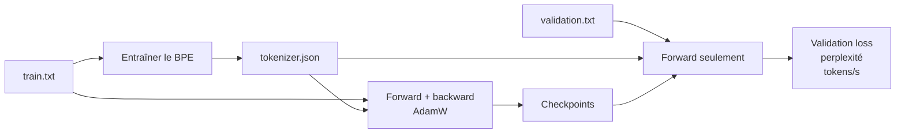
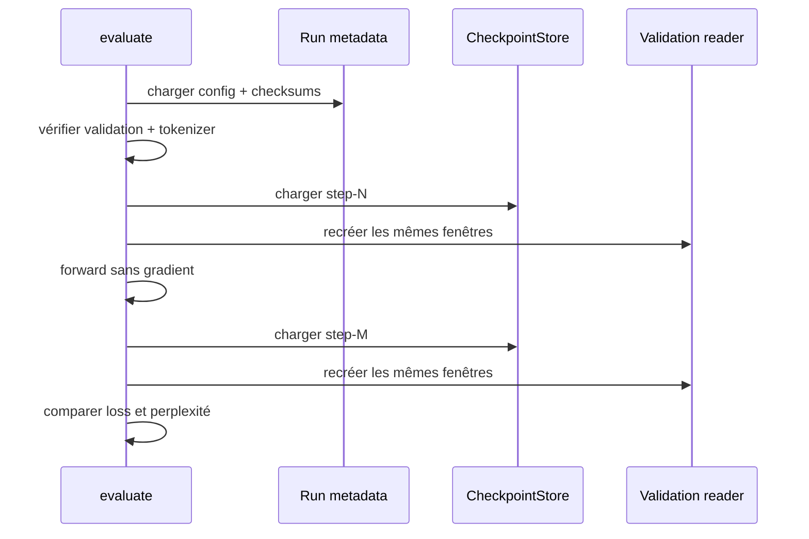

# Évaluation et premier tiny corpus

## Pourquoi la train loss ne suffit pas

La train loss est calculée sur les tokens qui produisent les gradients. Elle peut continuer à baisser simplement parce que le modèle mémorise ces données. Pour mesurer sa capacité à prédire des séquences non utilisées par l'optimizer, il faut un corpus de validation séparé et une passe sans backward.



PR12 exige deux fichiers physiques. Le tokenizer est entraîné sur `train.txt` seulement. Entraîner ses merges sur la validation serait déjà laisser l'évaluation influencer la représentation des données.

## Cross-entropy pondérée par token

`NextTokenCrossEntropy` retourne la moyenne d'un batch. Le dernier batch peut être plus petit; moyenner naïvement les moyennes donnerait alors le même poids à un petit et un grand batch. L'évaluateur agrège plutôt :

```text
validation loss = somme_b(loss_b × tokens_b) / somme_b(tokens_b)
```

Chaque token de validation contribue donc également. Les fenêtres sont disjointes, de longueur `contextLength`, et ne traversent jamais d'un fichier à l'autre.

## Évaluation sans gradient

Le modèle est appelé avec `training=false` et sans `GradientCollector`. Les paramètres et les éventuels buffers de gradient doivent être bit-à-bit identiques avant et après la passe. Un test protège cet invariant.

L'absence de backward réduit le travail, mais ne transforme pas DJL en moteur d'inférence optimisé : PR12 n'ajoute ni `InferenceMode` backend ni KV cache.

## Perplexité

Pour une cross-entropy moyenne en logarithme naturel :

```text
perplexité = exp(validation loss)
```

Une loss de `ln(4)` donne une perplexité de `4`. Intuitivement, une perplexité plus basse indique une distribution plus concentrée autour des vrais prochains tokens.

La perplexité n'est comparable qu'avec le même tokenizer et les mêmes données. Changer les merges change l'unité prédite; le nombre n'est alors plus sur la même échelle expérimentale.

## Débit

L'évaluateur mesure :

```text
tokens/s = nombre de positions évaluées / durée du forward
```

`train corpus` enregistre un débit cumulatif end-to-end : tokens d'entraînement vus divisés par le temps du run, incluant les validations, samples et checkpoints. `evaluate` mesure seulement ses forwards de validation. Ces deux valeurs répondent à des questions différentes.

Un tiny run de moins d'une seconde est très sensible au warmup JVM, aux caches natifs et à l'ordonnancement. Son débit prouve que la mesure existe; il ne prédit pas directement la vitesse du 17 M.

## Checksums et comparaison fermée

Chaque run conserve :

- SHA-256 du fichier train;
- SHA-256 du fichier validation;
- SHA-256 du tokenizer appris sur train;
- SHA-256 de la configuration copiée;
- options de l'expérience dans `experiment.json`;
- une métrique JSONL par update;
- samples greedy aux jalons d'évaluation;
- manifestes et checksums des checkpoints.

`evaluate` refuse un corpus validation ou un tokenizer dont le checksum diffère. Il accepte seulement des identifiants `step-00000000` sous le dossier de checkpoints du run.



## Artifacts d'un run PR12

```text
run/
|-- config.yaml
|-- tokenizer.json
|-- run-metadata.json
|-- experiment.json
|-- metrics.jsonl
|-- checkpoints/
|   |-- step-00000020/
|   |-- step-00000040/
|   `-- step-00000060/
`-- samples/
    |-- step-00000001.txt
    |-- step-00000010.txt
    `-- ...
```

`experiment.json` fixe notamment le total d'updates, les cadences, le shuffle buffer, les prompts et `sampleTokens`. Les chemins peuvent changer de machine; les checksums fixent le contenu.

## Samples qualitatifs

Loss et perplexité mesurent le prochain token moyen, pas la cohérence d'un texte long. PR12 génère donc aussi les mêmes prompts en greedy à chaque jalon.

Un modèle initial peut produire une suite de bytes UTF-8 invalide. Ce sample est enregistré avec ses IDs au lieu de faire échouer l'entraînement. Un modèle qui baisse sa loss mais répète un seul caractère n'a pas franchi la porte qualitative.

## Porte vers le 17 M

Le lancement 17 M demande au minimum :

1. tous les tests automatisés verts;
2. single-batch overfit réussi;
3. validation loss et perplexité en baisse sur un vrai split sans fuite;
4. samples qui progressent vers du texte cohérent, pas seulement des répétitions;
5. corpus, licence, checksums et budget de tokens documentés;
6. débit et mémoire mesurés sur une configuration plus représentative.

PR12 satisfait les trois premières conditions et l'instrumentation de la cinquième. Son corpus de 1 291 tokens et ses samples répétitifs ne satisfont pas les autres. La décision rationnelle est donc **ne pas encore lancer le 17 M**.

La décision d'architecture est consignée dans [ADR 0007](architecture/decisions/0007-explicit-verified-corpus-splits.md). Les commandes et résultats complets se trouvent dans la [note de laboratoire PR12](lab-notes/pr-12-evaluation-and-tiny-corpus.md).
