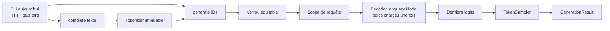
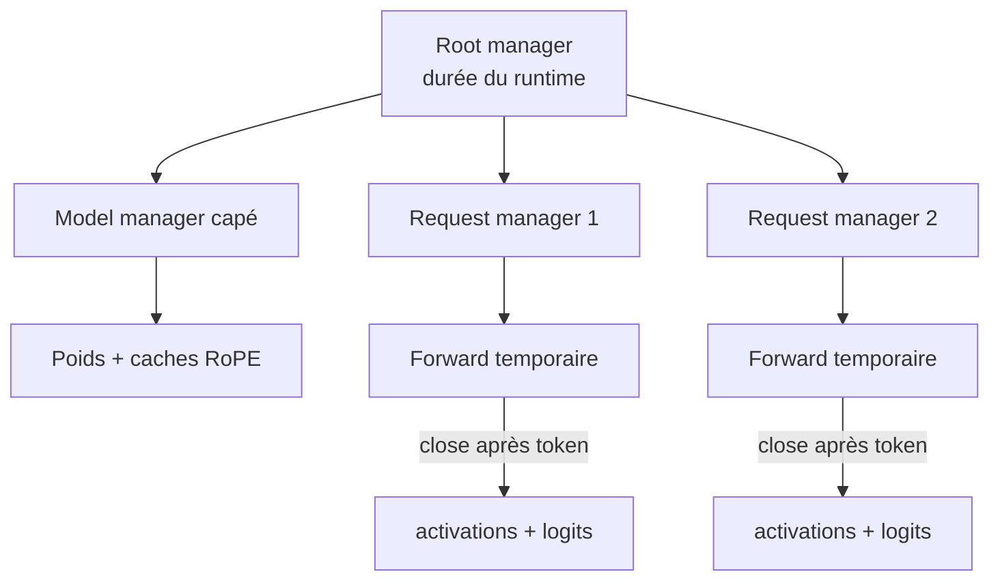

# Runtime d'inférence réutilisable

PR11 savait générer du texte, mais sa CLI recréait le modèle et relisait le checkpoint à chaque exécution. PR14 sépare ce cycle de vie de la requête : `InferenceRuntimeLoader` vérifie et charge les artefacts une fois, puis `InferenceRuntime` répond à plusieurs appels Kotlin `generate()` ou `complete()`.

## Les deux API

- `generate(TokenGenerationRequest)` accepte des IDs et retourne la trace `GenerationResult`. C'est l'API exacte pour comparer les logits et les décisions de sampling.
- `complete(CompletionRequest)` encode un texte, appelle `generate()`, puis décode le résultat. C'est l'API pratique pour les futurs adaptateurs.

Le runtime représente un modèle **base**. Son ID stable, par exemple `lxp-mini-1xm-17m-base`, identifie un artefact; il ne transforme pas ce modèle en assistant et ne promet aucune capacité de chat.

## Ownership DJL

Les poids et les temporaires n'ont pas la même durée de vie. Le manager racine appartient au runtime. Son sous-manager modèle conserve les paramètres et les caches RoPE, puis est `cap()` après le chargement. Chaque requête reçoit un sous-manager frère fermé à la fin de l'appel; chaque forward utilise à son tour un scope temporaire.

Fermer un scope de requête libère ses tenseurs natifs sans toucher aux poids. `close()` prend le même verrou que la génération, ferme modèle, manager modèle et manager racine, et demeure idempotent.

## Pourquoi sérialiser les requêtes

PR14 annonce `SERIALIZED` au lieu de laisser une concurrence implicite. Un `ReentrantLock` équitable autorise plusieurs threads appelants, mais exécute une génération à la fois et empêche `close()` de couper un forward en cours.

Ce choix privilégie d'abord la sûreté : partage des poids explicite, scopes isolés et comportement déterministe. Il ne prétend pas maximiser le débit. Le batching, plusieurs réplicas et un ordonnanceur pourront être mesurés séparément; les ajouter maintenant mélangerait cycle de vie et optimisation.

## Chargement vérifié

Le loader refuse de construire un runtime lorsque :

- l'ID ne respecte pas le format stable en minuscules;
- le checksum de `config.yaml` diffère du manifeste du run;
- la taille ou le type du tokenizer ne correspond pas au run;
- le checksum du tokenizer, lorsqu'il est déclaré, diffère;
- le checkpoint le plus récent ou ses poids échoue à la validation PR10.

Si une étape échoue, les managers déjà ouverts sont fermés transactionnellement. Une fois le runtime construit, les fichiers ne sont plus relus pour chaque requête.

## Limites intentionnelles

- Aucun cache KV : chaque nouveau token recalcule toute la fenêtre. PR15 mesurera et corrigera ce coût.
- Aucun HTTP, JSON OpenAI, rôle de chat ou system prompt dans le runtime. PR16 ajoutera un adaptateur externe.
- Une completion byte peut produire des IDs qui ne forment pas encore un UTF-8 valide. `complete()` retourne alors une erreur claire; `generate()` reste disponible pour inspecter les IDs.
- Le compteur de ressources est un garde-fou de pente, pas une mesure de RAM ou VRAM en octets.

La décision complète est enregistrée dans [ADR 0009](architecture/decisions/0009-single-loaded-serialized-inference-runtime.md) et les commandes reproductibles se trouvent dans la [note de laboratoire PR14](lab-notes/pr-14-inference-runtime.md).
