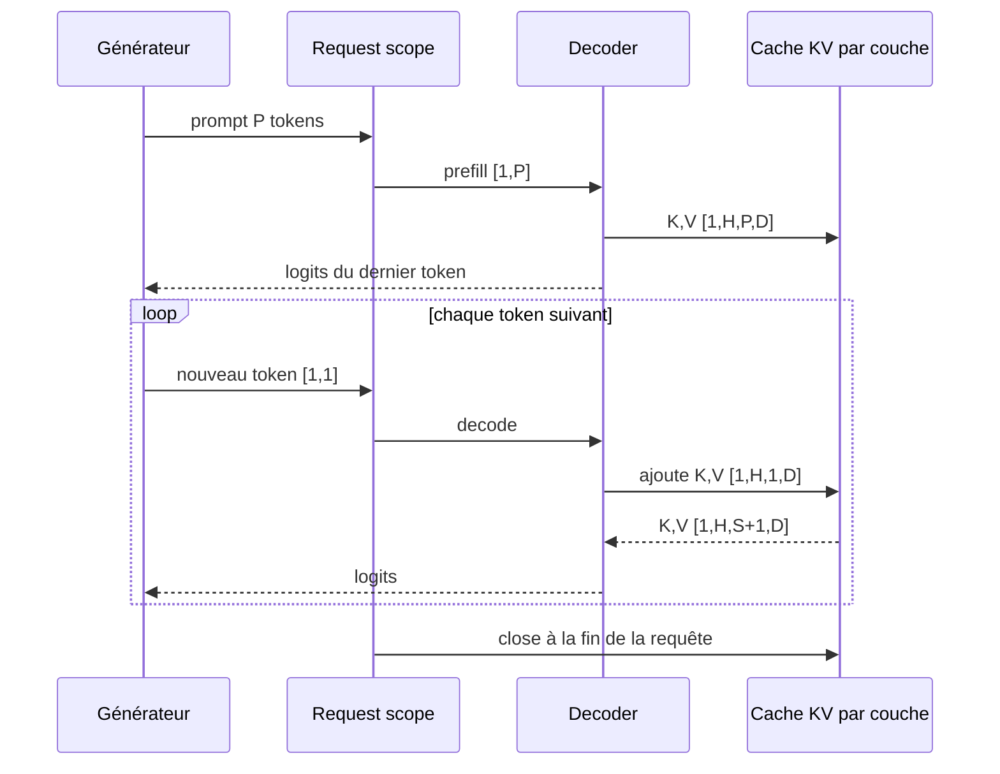
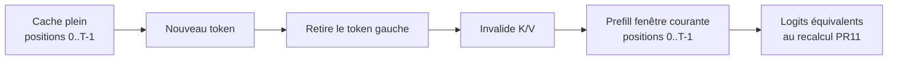

# Cache KV et gestion du contexte

Sans cache, la génération PR14 repasse tout le contexte dans le Transformer avant chaque nouveau token. Pourtant, dans une attention causale, les clés K et valeurs V des tokens passés ne changent pas. PR15 les conserve par couche et ne projette que le nouveau token pendant le décodage.

## Prefill puis decode

Le **prefill** traite le prompt entier. Pour chaque couche, il produit et conserve deux tenseurs :

```text
keys   [B, H, S, D]
values [B, H, S, D]
```

`B` est le batch, `H` le nombre de têtes, `S` la longueur déjà cachée et `D = dModel / numHeads`. Le **decode** reçoit ensuite un seul token `[B,1]`, calcule son Q/K/V, ajoute K/V au cache et compare sa query à toutes les clés cachées.



Le forward complet demeure inchangé pour l'entraînement et sert d'oracle numérique. Le chemin incrémental est inference-only.

## Travail évité

Pour un prompt de `P` tokens et `N` tokens générés sans EOS :

```text
recalcul complet = P + (P+1) + ... + (P+N-1) tokens traités
cache KV         = P + (N-1) tokens traités
```

Le dernier token échantillonné n'a pas besoin d'un forward supplémentaire. Dans l'expérience `P=3, N=128`, le modèle traite `8 512` tokens sans cache contre `130` avec cache.

Cette réduction ne garantit pas un gain immédiat sur un tiny model. Concaténer les caches, gérer les scopes et lancer beaucoup de petites opérations possède un coût fixe. Le gain apparaît lorsque le contexte ou le modèle rend le recalcul plus coûteux.

## Deux politiques de contexte

### `REJECT`

Le runtime refuse la requête avant calcul lorsque `promptTokens + maxNewTokens > contextLength`. Cette politique est prévisible pour une API : aucun token du prompt ne disparaît.

### `SLIDING_WINDOW`

Le runtime conserve les derniers `contextLength` tokens, comme PR11. Un prompt déjà trop long perd ses tokens de gauche et `promptTokensDiscarded` le rend visible.

Quand le cache atteint la limite et que la fenêtre glisse, PR15 invalide tous les K/V puis refait un prefill sur la nouvelle fenêtre. Cette reconstruction est nécessaire pour préserver la sémantique existante : PR11 renumérote la fenêtre de `0` à `T-1`, tandis que des clés RoPE simplement évincées conserveraient leurs anciennes rotations.



PR15 privilégie donc l'équivalence. Une stratégie RoPE à positions absolues au-delà du contexte serait une autre sémantique et demanderait entraînement et évaluations dédiés.

## Lifecycle et isolation

Le cache appartient au scope natif de la requête, jamais au runtime partagé. Chaque requête, même appelée depuis un autre thread, obtient ses propres K/V. Fermer la requête ferme immédiatement le manager du cache; les poids restent dans le manager modèle capé.

Les tests intercalent deux caches contenant des séquences différentes, ferment le premier et continuent d'utiliser le second. Ils comparent aussi chaque logit incrémental au forward complet avec une tolérance absolue de `1e-5`.

## Métriques disponibles

- `prefillTokensProcessed` et `prefillNanos`;
- `decodeTokensProcessed` et `decodeNanos`;
- `cacheInvalidations` et `peakCachedTokens`;
- `promptTokensDiscarded`;
- `modelTokensProcessed` et `generatedTokensPerSecond`.

Ces temps couvrent le calcul modèle et la matérialisation des derniers logits, pas le chargement du runtime ni le sampling. Consulte [ADR 0010](architecture/decisions/0010-request-scoped-kv-cache.md) et le [laboratoire PR15](lab-notes/pr-15-kv-cache-and-context.md).
