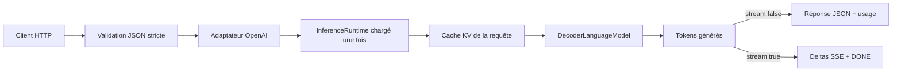
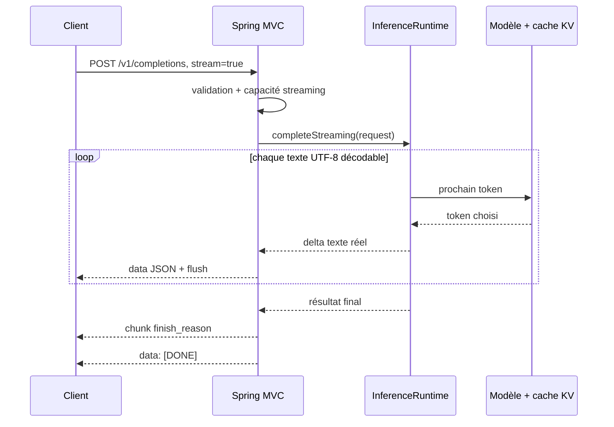

# Serveur OpenAI-compatible et streaming SSE

PR16 place un adaptateur HTTP autour de `InferenceRuntime`. Le serveur ne réimplémente ni le tokenizer, ni le sampling,
ni le cache KV : il valide le JSON, traduit la requête, puis laisse le runtime posséder le calcul et les ressources DJL.



## Démarrer le serveur

Le binding est limité à `127.0.0.1` et le streaming est désactivé par défaut :

```powershell
.\gradlew.bat run --args="serve --model-id lxp-mini-pr16-tiny-base --run-dir $runDir --tokenizer $tokenizerPath --port 8080 --no-streaming-enabled"
```

Pour autoriser `stream:true` :

```powershell
.\gradlew.bat run --args="serve --model-id lxp-mini-pr16-tiny-base --run-dir $runDir --tokenizer $tokenizerPath --port 8080 --streaming-enabled"
```

Les deux interrupteurs ont des responsabilités différentes :

| Niveau  | Valeur                   | Effet                                                         |
|---------|--------------------------|---------------------------------------------------------------|
| serveur | `--no-streaming-enabled` | refuse toute requête `stream:true`; valeur par défaut         |
| serveur | `--streaming-enabled`    | autorise les réponses SSE                                     |
| requête | `"stream": false`        | produit un unique objet JSON, même si le serveur autorise SSE |
| requête | `"stream": true`         | produit des événements SSE seulement si le serveur l'autorise |

Un host non loopback exige `--allow-remote`. Cette protection est volontaire : PR16 n'implémente aucune
authentification ni TLS.

## Contrat exposé

| Endpoint                 | Support                                           |
|--------------------------|---------------------------------------------------|
| `GET /health`            | état, modèle, checkpoint et capacité streaming    |
| `GET /v1/models`         | liste contenant l'unique runtime chargé           |
| `GET /v1/models/{model}` | métadonnées du modèle ou erreur `model_not_found` |
| `POST /v1/completions`   | completion texte legacy, JSON ou SSE              |

PR16 suit la forme de la ressource legacy Completions et de la ressource Models documentées par OpenAI, sans prétendre
supporter toute leur surface ([Completions](https://developers.openai.com/api/reference/resources/completions),
[Models](https://developers.openai.com/api/reference/resources/models)).

### Matrice des champs

| Champ                                                                           | Support PR16      | Traduction réelle                                  |
|---------------------------------------------------------------------------------|-------------------|----------------------------------------------------|
| `model`                                                                         | requis            | doit être l'identifiant du runtime chargé          |
| `prompt`                                                                        | chaîne requise    | encodé par le tokenizer du checkpoint              |
| `max_tokens`                                                                    | oui, défaut `16`  | `maxNewTokens`; budget total borné par le contexte |
| `temperature`                                                                   | oui, `[0,2]`      | `0` active greedy, sinon sampling                  |
| `top_p`                                                                         | oui, `(0,1]`      | nucleus sampling                                   |
| `seed`                                                                          | oui               | seed du sampler local                              |
| `stream`                                                                        | oui               | JSON ou vrais deltas SSE selon la capacité serveur |
| `n` / `best_of`                                                                 | seulement `1`     | une seule génération                               |
| `echo`                                                                          | seulement `false` | le texte retourné est uniquement la continuation   |
| `stop`, `logprobs`, pénalités, `logit_bias`, `suffix`, `user`, `stream_options` | non               | erreur `unsupported_feature`                       |
| champ inconnu                                                                   | non               | erreur `unknown_parameter`; jamais ignoré          |

Les erreurs utilisent `{ "error": { "message", "type", "param", "code" } }`. Le serveur refuse le budget avant
le forward avec `prompt_tokens + max_tokens <= contextLength`; l'API n'emploie pas la fenêtre glissante implicitement.

## Cycle du streaming



Le callback est exécuté pendant la génération, et non après avoir accumulé la réponse. Si l'écriture réseau échoue,
l'exception remonte à travers la boucle; le scope de requête et son cache KV sont tout de même fermés par `use`.
Le runtime demeure `SERIALIZED` : plusieurs connexions peuvent attendre, mais un seul forward s'exécute à la fois.

### Bytes générés et UTF-8 invalide

Un tokenizer byte-level sait représenter les 256 valeurs possibles, mais une suite arbitraire de bytes n'est pas
nécessairement du texte UTF-8 valide. C'est fréquent avec le tiny checkpoint de démonstration, encore insuffisamment
entraîné pour toujours produire des séquences linguistiques valides.

Le décodage reste strict dans le pipeline tokenizer afin de détecter les datasets et artefacts incorrects. Seule la
frontière d'affichage de l'inférence utilise un décodage tolérant : chaque séquence invalide est remplacée par `�`
(`U+FFFD`) plutôt que de transformer une completion valide au niveau des IDs en erreur HTTP 500. En SSE, un préfixe
incomplet est d'abord mis en attente; s'il devient valide avec le token suivant, le caractère réel est diffusé. Le
reliquat réellement invalide est remplacé et envoyé avant le chunk final, ce qui garantit que le texte streamé est
identique au texte non streamé.

## Pourquoi Spring sans plugin Boot

Le serveur utilise Spring Boot `3.5.16` comme BOM et Spring MVC embarqué. Cette ligne supporte Java 25 selon les
[prérequis Spring Boot 3.5](https://docs.spring.io/spring-boot/3.5/system-requirements.html). Le plugin Gradle Boot
n'est pas appliqué : le projet conserve son application Gradle existante et évite de lier son packaging au plugin,
tout en utilisant l'auto-configuration et le serveur embarqué comme bibliothèques.

La décision complète est dans [ADR 0011](architecture/decisions/0011-strict-openai-adapter-and-opt-in-sse.md) et les
commandes reproductibles sont dans le [laboratoire PR16](lab-notes/pr-16-openai-completions.md).

## Extension : device et playground

`GET /` sert maintenant un playground local sans React ni npm. `GET /health` ajoute paramètres, device sélectionné,
type de modèle et longueur de contexte. `app.js` et `app.css` sont des ressources Spring; une route inconnue retourne
une erreur 404 normalisée.

Le playground appelle `POST /playground/completions`. Cet endpoint expérimental ne remplace pas le contrat OpenAI :
il reçoit les tours conservés dans le navigateur, passe par `ChatPromptFormatter`, puis crée une `CompletionRequest`.
Le bouton Clear ne fait aucun appel réseau.

Pour un playground utilisable, choisir le preset à contexte 256 plutôt que `lab-pr09-tiny.yaml` à contexte 8 :

```powershell
$labId = Get-Date -Format yyyyMMdd-HHmmss
$runDir = "build/labs/pr16/playground-$labId"
$tokenizerPath = "build/labs/pr16/playground-tokenizer-$labId.json"
.\gradlew.bat run --args="tokenizer byte create --output $tokenizerPath"
.\gradlew.bat run --args="train checkpoint-demo --config configs/lab-pr15-kv-cache.yaml --run-dir $runDir --before-updates 80 --after-updates 1"
.\gradlew.bat -PpytorchNative=cpu run --args="serve --model-id lxp-mini-pr16-playground-base --run-dir $runDir --tokenizer $tokenizerPath --device cpu --port 8080 --streaming-enabled"
```

Ouvrir ensuite `http://localhost:8080/`. La sélection CPU/GPU, CUDA, la VRAM et la limite du faux « system prompt »
sont détaillées dans [Device runtime et playground](architecture/runtime-device-and-playground.md) et
[ADR 0012](architecture/decisions/0012-central-runtime-device-and-replaceable-chat-format.md).
