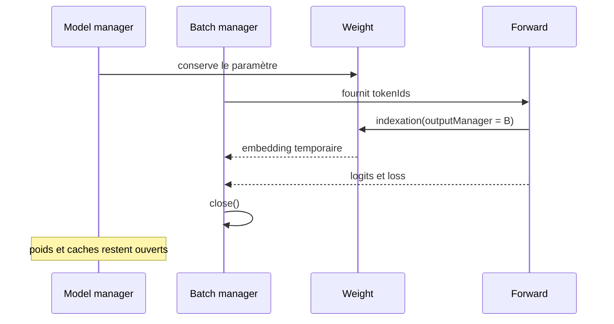

# ADR 0008 - Temporaires du forward possédés par le batch

## Statut

Accepté le 2026-08-30, correctif bloquant avant PR13.

## Contexte

Une validation du modèle 17,3 M réussissait avec un batch, mais provoquait de façon reproductible un `EXCEPTION_ACCESS_VIOLATION` dans `c10.dll` avec 20 batches. Les inputs étaient créés dans un sous-manager temporaire, pourtant le nombre de ressources durables augmentait.

DJL attache par défaut le résultat d'une opération au manager du premier `NDArray`. `TokenEmbedding` indexait le poids durable en premier; le LM head lié transposait aussi son poids durable. Ces deux opérations pouvaient donc faire naître des temporaires sous le manager modèle. L'optimizer explicite recréait également quatre wrappers par gradient et par update sans les fermer.

## Décision

- L'indexation de l'embedding reçoit explicitement `tokenIds.manager`.
- Le head lié crée une vue complète du poids dans `input.manager`, puis transpose cette vue.
- Les poids et caches RoPE restent sous le manager modèle.
- Inputs, embeddings, activations, vues du head, logits et loss appartiennent au manager du batch.
- `tempAttachAll` n'est pas utilisé pour déplacer un paramètre pendant le forward.
- Une update acquiert chaque vue de gradient une seule fois, la réutilise et la ferme en `finally`.
- L'évaluateur peut publier un snapshot du nombre d'arrays avant la validation et après chaque batch fermé.

## Conséquences

Le modèle supporte des évaluations et des updates répétées sans accumuler les wrappers dans le manager longue durée. Le weight tying reste réel et les gradients continuent de traverser les vues du poids.

Le head lié crée une vue de batch supplémentaire à chaque forward. Ce coût de métadonnées est accepté pour rendre la durée de vie explicite; il ne duplique pas la matrice de poids comme le ferait un second LM head.

Les tests utilisent un manager modèle capé. Ils échoueront immédiatement si une future opération recrée un temporaire depuis un paramètre comme premier opérande. Le test prolongé vérifie aussi une série de compteurs stable, car l'absence d'exception seule serait insuffisante.

## Alternatives rejetées

- Réduire le nombre de batches, le batch size ou le contexte masque la fuite.
- `System.gc()`, les pauses et une heap JVM plus grande ne pilotent pas la mémoire PyTorch native.
- Fermer des intermédiaires au hasard rendrait le graphe backward fragile.
- Déplacer temporairement les poids eux-mêmes dans le batch compliquerait leur lifetime et l'accumulation de gradients.
