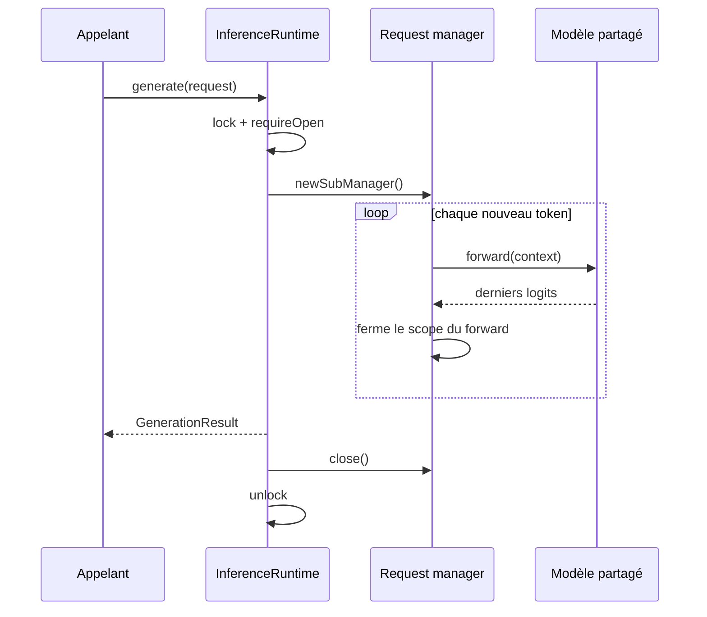

# ADR 0009 - Runtime chargé une fois et inférence sérialisée

## Statut

Accepté le 2026-08-30 pour PR14.

## Contexte

La CLI PR11 prouvait la génération, mais son cycle de vie chargeait configuration, tokenizer, modèle et checkpoint pour une seule completion. Répéter ce chemin gaspille les lectures, la reconstruction des blocs et l'allocation des poids. Un futur serveur doit conserver ces ressources sans introduire HTTP dans le coeur.

DJL utilise de la mémoire native à durée de vie explicite. Partager un modèle tout en laissant des requêtes créer des temporaires dans son manager risquerait de réintroduire la fuite corrigée avant PR13. La politique de concurrence devait également être un contrat, pas un détail accidentel.

## Décision

- `InferenceRuntimeLoader` valide la provenance et charge un checkpoint une seule fois.
- Le runtime possède un manager racine, un manager modèle capé, le modèle, le tokenizer et son `ParameterStore`.
- Un sous-manager neuf appartient à chaque requête et un enfant temporaire à chaque forward.
- `generate()` expose les IDs; `complete()` adapte texte vers IDs puis IDs vers texte.
- Un ID explicite et validé identifie le modèle `BASE`.
- Un verrou équitable sérialise génération et fermeture; le contrat publie `SERIALIZED`.
- `close()` est idempotent et ferme les ressources dans l'ordre modèle, manager modèle, manager racine.
- Le runtime ne dépend d'aucun transport.

## Conséquences

Les requêtes évitent les rechargements et leurs temporaires sont libérés de façon déterministe. Plusieurs threads peuvent utiliser l'API sans exécuter simultanément le modèle. La fermeture attend une requête en cours et les appels ultérieurs échouent clairement.

La latence d'une requête concurrente inclut l'attente du verrou. Ce compromis est visible et testable. PR14 ne fournit ni batching, ni réplication, ni cache KV; ces optimisations exigent leurs propres mesures et invariants d'isolation.

## Alternatives rejetées

- Recharger pour chaque appel est simple, mais rendrait un serveur inutilement lent et coûteux.
- Autoriser des forwards concurrents sans limite ne documenterait ni la sûreté DJL ni la pression mémoire maximale.
- Créer un runtime par thread dupliquerait les poids et masquerait le budget mémoire.
- Ajouter Ktor ou des DTO OpenAI couplerait le coeur au transport avant que son cycle de vie soit prouvé.
- Ajouter le cache KV dans la même PR empêcherait d'isoler son équivalence numérique et son gain réel.
