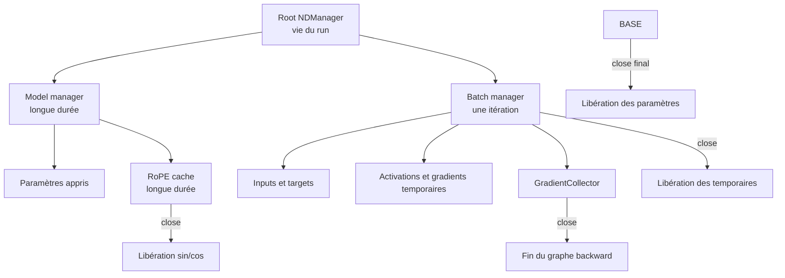
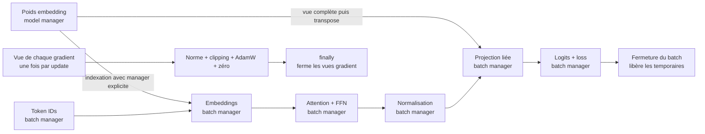

# Gestion de la mémoire native DJL

## Pourquoi le garbage collector ne suffit-il pas?

Les `NDArray` DJL référencent des allocations du moteur natif. La JVM connaît l'objet Java, mais ne décide pas seule du meilleur moment pour libérer la mémoire CPU native ou GPU. Attendre le garbage collector pendant l'entraînement peut donc faire croître la RAM ou la VRAM entre les batches.

## Hiérarchie retenue



PR05 utilise un base manager pour la démonstration et un sous-manager dédié aux caches RoPE. La commande ferme dans cet ordre : collecteur, cache RoPE, blocs, puis manager de base.

## La règle du premier opérande

DJL attache normalement le résultat d'une opération au manager de son premier `NDArray`. Cette règle est pratique quand le premier opérande est une activation du batch, mais dangereuse quand il s'agit d'un poids.

L'ancien embedding faisait :

```kotlin
weight.get(NDIndex("{}", tokenIds))
```

`weight` appartient au modèle. La sortie de l'indexation survivait donc à la fermeture du batch et les opérations suivantes héritaient de cette mauvaise durée de vie. Une validation répétée pouvait faire croître les ressources natives jusqu'à un crash dans `c10.dll`.

Le contrat corrigé est explicite :

```kotlin
weight.get(tokenIds.manager, NDIndex("{}", tokenIds))
```

Le LM head lié exige aussi une transposition du poids `[V,C]`. Comme `weight.transpose()` créerait d'abord une vue côté modèle, le code crée une vue complète dans le manager de l'input avant de la transposer :

```kotlin
weight.get(input.manager, NDIndex(":, :")).transpose()
```

Le poids reste durable; seules les deux vues sont temporaires. Nous n'empruntons pas le paramètre complet avec `tempAttachAll`, car son ownership changerait pendant le forward et compliquerait l'accumulation de gradients entre plusieurs micro-batches.

L'audit a aussi trouvé un problème dans l'optimizer explicite. Chaque accès à `parameter.array.gradient` produit un wrapper `NDArray`. L'ancienne update recréait la séquence quatre fois pour la norme, le clipping, AdamW et la remise à zéro : `4 x 74 = 296` wrappers supplémentaires par update sur le 17,3 M. L'update acquiert désormais une seule liste de vues, la réutilise, puis la ferme dans un `finally`. Les moments Adam conservés en interne par DJL restent persistants par intention.



## Comment le correctif est prouvé

Le test d'embedding sépare un manager modèle capé et un manager batch frère. Il vérifie directement `weight.manager`, `tokenIds.manager` et `output.manager`; la sortie doit être libérée avec le batch tandis que le poids reste ouvert.

Le soak test d'évaluation exécute 128 batches sur un tiny model. Il observe le nombre d'arrays avant l'évaluation puis après chaque fermeture, vérifie une série constante, une loss finie, les mêmes paramètres et des buffers de gradient bit-à-bit inchangés. `cap()` transforme toute tentative d'attachement au manager modèle en erreur immédiate.

La CLI expose le même diagnostic avec `--trace-evaluation-resources`. Sur le preset réel de 17 308 032 paramètres, deux évaluations de 100 batches ont toutes deux produit un plateau constant de `90` arrays. Avant la correction des vues de gradient, les niveaux intermédiaires étaient `386`, puis `682`; leur delta de `296` correspondait exactement à quatre wrappers pour chacun des 74 paramètres.

Un compteur stable ne mesure pas directement les octets natifs et n'est pas une preuve universelle contre toute fuite backend. Combiné au manager capé, à 128 batches CI, à 200 batches réels et à la disparition du crash reproductible, il prouve la chaîne d'ownership visée. La référence de sémantique est la [documentation mémoire officielle de DJL](https://djl.ai/docs/development/memory_management.html).

## Règles pour les prochaines PR

- Utiliser `use {}` pour chaque `NDManager`, `GradientCollector`, `Batch`, modèle ou trainer `AutoCloseable`.
- Créer un sous-manager par batch afin que les activations temporaires aient une fin de vie claire.
- Ne jamais retourner un `NDArray` appartenant à un sous-manager déjà fermé; utiliser les mécanismes `ret`/`attach` DJL lorsque le transfert de propriété est nécessaire.
- Conserver les paramètres et caches de longue durée sous le manager du modèle, pas sous celui d'un batch.
- Tester `isReleased` ou `isOpen` sur les chemins critiques et profiler une boucle prolongée avant le premier long entraînement.
- Fermer aussi les chemins d'erreur avec `try/finally` ou `use`.

Depuis PR09, chaque micro-batch de la CLI possède son sous-manager. Le calcul de norme ferme aussi immédiatement les tenseurs `square` et `sum`, car ils sont créés depuis les gradients durables et hériteraient autrement du manager des poids.

## Que prouvent PR05, PR09 et le correctif pré-PR13?

`DjlEngineTest` ferme un manager de base, les tests de RoPE ferment son sous-manager sans fermer le parent, et les commandes `model components` et `train overfit-batch` impriment `Manager closed: true`. Le correctif ajoute la propriété qui manquait : les ressources temporaires restent stables pendant des forwards répétés. Un profil mémoire de plusieurs milliers de batches demeure requis avant un long entraînement, mais la porte des diagnostics 20 et 100 batches est franchie.
