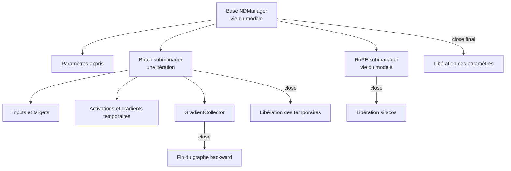

# Gestion de la mémoire native DJL

## Pourquoi le garbage collector ne suffit-il pas?

Les `NDArray` DJL référencent des allocations du moteur natif. La JVM connaît l'objet Java, mais ne décide pas seule du meilleur moment pour libérer la mémoire CPU native ou GPU. Attendre le garbage collector pendant l'entraînement peut donc faire croître la RAM ou la VRAM entre les batches.

## Hiérarchie retenue

PR05 utilise un base manager pour la démonstration et un sous-manager dédié aux caches RoPE. La commande ferme dans cet ordre : collecteur, cache RoPE, blocs, puis manager de base.

## Règles pour les prochaines PR

- Utiliser `use {}` pour chaque `NDManager`, `GradientCollector`, `Batch`, modèle ou trainer `AutoCloseable`.
- Créer un sous-manager par batch afin que les activations temporaires aient une fin de vie claire.
- Ne jamais retourner un `NDArray` appartenant à un sous-manager déjà fermé; utiliser les mécanismes `ret`/`attach` DJL lorsque le transfert de propriété est nécessaire.
- Conserver les paramètres et caches de longue durée sous le manager du modèle, pas sous celui d'un batch.
- Tester `isReleased` ou `isOpen` sur les chemins critiques et profiler une boucle prolongée avant le premier long entraînement.
- Fermer aussi les chemins d'erreur avec `try/finally` ou `use`.

Depuis PR09, chaque micro-batch de la CLI possède son sous-manager. Le calcul de norme ferme aussi immédiatement les tenseurs `square` et `sum`, car ils sont créés depuis les gradients durables et hériteraient autrement du manager des poids.

## Que prouvent PR05 et PR09?

`DjlEngineTest` ferme un manager de base, les tests de RoPE ferment son sous-manager sans fermer le parent, et les commandes `model components` et `train overfit-batch` impriment `Manager closed: true`. Ces tests vérifient le cycle de vie structurel; un soak test mémoire sur plusieurs milliers de batches reste nécessaire avant un long entraînement.
