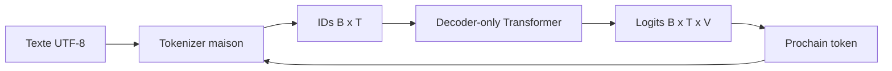
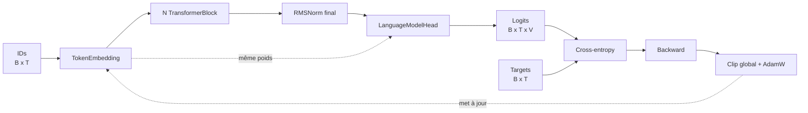

# Architecture globale

## Frontières

- `config` charge et valide les expériences sans dépendre d'une bibliothèque neuronale.
- `model` contient le compteur théorique et les primitives différentiables. PR05 ajoute embedding, RMSNorm et RoPE; PR06 ajoute l'attention; PR07 assemble un bloc; PR08 construit le decoder complet et ses logits.
- `training` relie depuis PR09 les logits aux targets avec cross-entropy, backward, accumulation, clipping global, AdamW et warmup/cosine.
- `cli` rend chaque concept exécutable depuis Gradle.
- `tokenizer` et `data` préparent les `IntArray`; `model` les convertira progressivement en calcul neuronal DJL.
- les futurs packages `generation` et `evaluation` apparaîtront seulement dans leur PR.

## Décisions de PR01

- mono-module Gradle pour garder la navigation simple;
- YAML strict afin qu'une faute de frappe échoue immédiatement;
- projections linéaires futures sans biais;
- weight tying activé par défaut;
- JDK 25, Gradle 9.1+ et Kotlin/JVM;
- aucune dépendance DJL n'a été ajoutée avant le premier tenseur en PR05; le code du modèle dépend de l'API DJL et non des classes internes PyTorch.

## État après PR09

Le forward et une boucle d'entraînement de référence existent. PR09 prouve l'apprentissage par mémorisation d'un lot synthétique; elle ne constitue pas encore une pipeline de corpus ni une mesure de généralisation. Les checkpoints arrivent en PR10 et l'évaluation en PR12.
