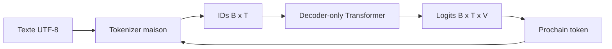

# Architecture globale

## Frontières

- `config` charge et valide les expériences sans dépendre d'une bibliothèque neuronale.
- `model` contient le compteur théorique et, depuis PR05, les primitives différentiables embedding, RMSNorm et RoPE.
- `cli` rend chaque concept exécutable depuis Gradle.
- `tokenizer` et `data` préparent les `IntArray`; `model` les convertira progressivement en calcul neuronal DJL.
- les futurs packages `training`, `generation` et `evaluation` apparaîtront seulement dans leur PR.

## Décisions de PR01

- mono-module Gradle pour garder la navigation simple;
- YAML strict afin qu'une faute de frappe échoue immédiatement;
- projections linéaires futures sans biais;
- weight tying activé par défaut;
- JDK 25, Gradle 9.1+ et Kotlin/JVM;
- aucune dépendance DJL n'a été ajoutée avant le premier tenseur en PR05; le code du modèle dépend de l'API DJL et non des classes internes PyTorch.
