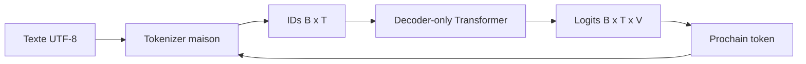
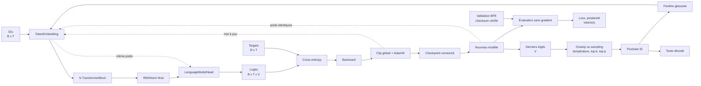

# Architecture globale

## Frontières

- `config` charge et valide les expériences sans dépendre d'une bibliothèque neuronale.
- `model` contient le compteur théorique et les primitives différentiables. PR05 ajoute embedding, RMSNorm et RoPE; PR06 ajoute l'attention; PR07 assemble un bloc; PR08 construit le decoder complet et ses logits.
- `training` relie depuis PR09 les logits aux targets avec cross-entropy, backward, accumulation, clipping global, AdamW et warmup/cosine.
- `checkpoint` crée depuis PR10 les runs, manifestes, checksums, métriques et round-trips de poids.
- `generation` transforme depuis PR11 les derniers logits en token avec greedy ou sampling filtré, puis maintient la boucle autorégressive.
- `evaluation` calcule depuis PR12 validation loss, perplexité et débit sans backward ni modification des poids.
- `cli` rend chaque concept exécutable depuis Gradle.
- `tokenizer` et `data` préparent les `IntArray`; `model` les convertira progressivement en calcul neuronal DJL.

## Décisions de PR01

- mono-module Gradle pour garder la navigation simple;
- YAML strict afin qu'une faute de frappe échoue immédiatement;
- projections linéaires futures sans biais;
- weight tying activé par défaut;
- JDK 25, Gradle 9.1+ et Kotlin/JVM;
- aucune dépendance DJL n'a été ajoutée avant le premier tenseur en PR05; le code du modèle dépend de l'API DJL et non des classes internes PyTorch.

## État après PR12

Le forward, la boucle d'entraînement, les checkpoints, la génération et l'évaluation de corpus existent. PR12 sépare physiquement train et validation, entraîne le tokenizer sur train seulement, vérifie leurs checksums et compare plusieurs checkpoints sur les mêmes fenêtres. Le KV cache, la reprise AdamW exacte et une qualité suffisante pour lancer le 17 M restent hors périmètre.
