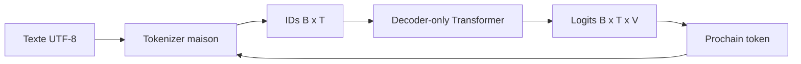

# Architecture globale

## Frontières

- `config` charge et valide les expériences sans dépendre d'une bibliothèque neuronale.
- `model` contient actuellement seulement le compteur théorique. Les tenseurs arriveront en PR05.
- `cli` rend chaque concept exécutable depuis Gradle.
- les futurs packages `tokenizer`, `data`, `training`, `generation` et `evaluation` apparaîtront seulement dans leur PR.

## Décisions de PR01

- mono-module Gradle pour garder la navigation simple;
- YAML strict afin qu'une faute de frappe échoue immédiatement;
- projections linéaires futures sans biais;
- weight tying activé par défaut;
- JDK 25, Gradle 9.1+ et Kotlin/JVM;
- aucune dépendance DJL avant le premier tenseur en PR05.
