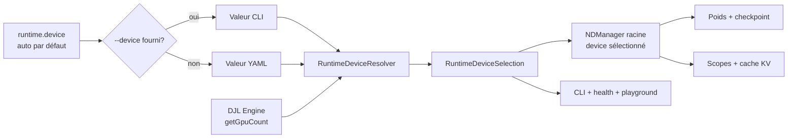
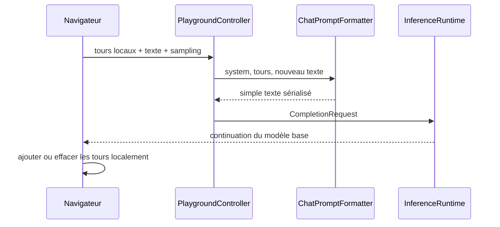

# Device runtime et playground local

## CPU, GPU et CUDA

Le CPU utilise la RAM système; le GPU NVIDIA utilise sa VRAM et parallélise les calculs via CUDA. `nvidia-smi`
décrit le driver et le GPU. Sa « CUDA Version » est la version maximale comprise par le driver, pas la preuve que le
CUDA Toolkit ou `nvcc` est installé. PyTorch 2.7.1/cu128 apporte les DLL nécessaires : un driver compatible suffit
pour les exécuter sans le toolkit de développement complet.



| Valeur | Comportement |
|---|---|
| `auto` | choisit `cuda:0` si DJL annonce un GPU utilisable, sinon `cpu` |
| `cpu` | force le CPU même si un GPU existe |
| `cuda:0` | exige GPU 0 et échoue explicitement s'il est indisponible |

Le YAML peut omettre cette section, dont le défaut est :

```yaml
runtime:
  device: auto
```

L'option CLI a priorité. `--device` choisit où calculer; `-PpytorchNative` choisit le runtime natif du nouveau
processus JVM :

```powershell
.\gradlew.bat run --args="runtime info --device auto"
.\gradlew.bat -PpytorchNative=cpu run --args="runtime info --device cpu"
.\gradlew.bat -PpytorchNative=cuda run --args="runtime info --device cuda:0"
```

Sous Windows, `cuda` verrouille `PYTORCH_VERSION=2.7.1` et `PYTORCH_FLAVOR=cu128`, puis ajoute le cache DLL DJL au
`PATH` du processus. Le premier lancement télécharge les bibliothèques officielles dans `~/.djl.ai`; les suivants
réutilisent ce cache. CPU reste supporté.

Les API vérifiées dans DJL 0.36.0 sont `Engine.getGpuCount()`, `Engine.getVersion()`, `Engine.getDjlVersion()`,
`Device.cpu()` et `Device.gpu(0)` ([JavaDoc Engine](https://javadoc.io/doc/ai.djl/api/0.36.0/ai/djl/engine/Engine.html),
[JavaDoc Device](https://javadoc.io/doc/ai.djl/api/0.36.0/ai/djl/Device.html)). Le moteur 0.36.0 supporte PyTorch
2.7.1 et documente Windows CPU/CUDA
([documentation DJL PyTorch](https://github.com/deepjavalibrary/djl/blob/master/engines/pytorch/pytorch-engine/README.md)).

## Ownership du device

`InferenceRuntimeLoader` résout le device une fois avant de créer le `NDManager` racine. Modèle, poids restaurés,
requêtes, cache KV et génération descendent de ce manager. Aucun contrôleur HTTP ne choisit son propre device.
`GenerateCommand` emploie le même resolver. Les commandes d'entraînement restent volontairement CPU dans PR16 afin
de ne pas changer leur sémantique; une future PR pourra injecter ce resolver à leur frontière.

## Playground et modèle base



Le navigateur ne crée aucune session serveur. « Effacer » vide seulement son tableau JavaScript.
`BaseModelChatPromptFormatter` écrit `System:`, `User:` et `Assistant:` dans le texte. Avant SFT, ce ne sont pas des
rôles appris : le system prompt est seulement un préfixe. Après Chat Template + SFT, le formatter pourra être remplacé
sans modifier l'interface web. Le playground demeure local, sans authentification, sur `127.0.0.1` par défaut.
