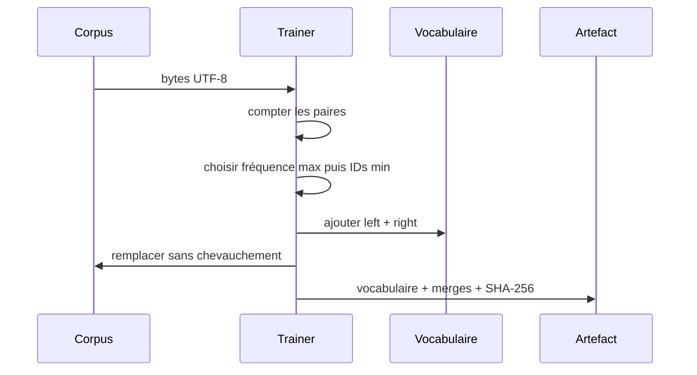

# PR03 - Byte-level BPE déterministe

## Ce que nous avons construit

PR03 ajoute un trainer byte-level BPE écrit en Kotlin, un encodeur qui rejoue ses merges, un artefact JSON strict et deux commandes exécutables. Aucun tenseur ni réseau neuronal n'est encore impliqué.



## Invariants à retenir

```text
vocabulaire de base = 3 tokens spéciaux + 256 bytes = 259
nombre de merges = vocabSize - 259
bytesPerToken = nombre de bytes UTF-8 / nombre de tokens produits
```

Une valeur bytes/token plus grande signifie que les pièces BPE regroupent davantage de bytes. Ce ratio mesure la compression de la tokenization, pas la qualité linguistique future du modèle.

## Comment exécuter PR03

Sous Windows PowerShell, depuis la racine du projet :

```powershell
.\gradlew.bat test
.\gradlew.bat run --args="tokenizer bpe train --input docs/lab-notes/samples/pr03-corpus.txt --vocab-size 272 --output build/labs/pr03/tokenizer.json"
.\gradlew.bat run --args="tokenizer bpe inspect --tokenizer build/labs/pr03/tokenizer.json --text 'Bonjour bonjour' --show-merges 13 --show-vocabulary 13"
```

Sous Linux ou macOS, remplace `.\gradlew.bat` par `./gradlew`.

La première commande doit terminer par `BUILD SUCCESSFUL`. L'entraînement doit annoncer un vocabulaire de 272 et 13 merges. L'inspection doit restituer exactement `Bonjour bonjour`.

## Expérience 1 - Calculer deux merges à la main

Le cas `abab` est protégé par un test automatisé :

```powershell
.\gradlew.bat test --tests '*BpeTokenizerTrainerTest.learns*'
```

Calcul attendu :

```text
a -> byte 97 -> token 100
b -> byte 98 -> token 101
[100, 101, 100, 101]
(100, 101) -> 259, fréquence 2
[259, 259]
(259, 259) -> 260, fréquence 1
[260]
```

## Expérience 2 - Comparer trois tailles de vocabulaire

Le vocabulaire byte de référence contient déjà 259 entrées. Entraîne ensuite 5 puis 13 merges :

```powershell
.\gradlew.bat run --args="tokenizer bpe train --input docs/lab-notes/samples/pr03-corpus.txt --vocab-size 259 --output build/labs/pr03/tokenizer-259.json"
.\gradlew.bat run --args="tokenizer bpe train --input docs/lab-notes/samples/pr03-corpus.txt --vocab-size 264 --output build/labs/pr03/tokenizer-264.json"
.\gradlew.bat run --args="tokenizer bpe train --input docs/lab-notes/samples/pr03-corpus.txt --vocab-size 272 --output build/labs/pr03/tokenizer-272.json"
```

Inspecte le même fichier avec chaque artefact et relève `Token count` et `Bytes per token` :

```powershell
.\gradlew.bat run --args="tokenizer bpe inspect --tokenizer build/labs/pr03/tokenizer-259.json --text-file docs/lab-notes/samples/pr03-corpus.txt --summary-only --show-merges 0 --show-vocabulary 0"
.\gradlew.bat run --args="tokenizer bpe inspect --tokenizer build/labs/pr03/tokenizer-264.json --text-file docs/lab-notes/samples/pr03-corpus.txt --summary-only --show-merges 5 --show-vocabulary 5"
.\gradlew.bat run --args="tokenizer bpe inspect --tokenizer build/labs/pr03/tokenizer-272.json --text-file docs/lab-notes/samples/pr03-corpus.txt --summary-only --show-merges 13 --show-vocabulary 13"
```

Le nombre de tokens doit diminuer et bytes/token doit augmenter avec les merges appris sur ce même corpus. N'interprète pas cela comme une preuve qu'un vocabulaire toujours plus grand est meilleur : chaque entrée agrandira la future matrice d'embeddings de `dModel` poids.

Résultats observés le 2026-08-29 avec le corpus versionné de 248 bytes :

| Vocabulaire | Merges | Tokens | Bytes/token | Round-trip |
|---:|---:|---:|---:|---|
| 259 | 0 | 248 | 1,000 | exact |
| 264 | 5 | 215 | 1,153 | exact |
| 272 | 13 | 181 | 1,370 | exact |

Ces nombres sont propres à ce corpus. Un texte différent peut contenir moins de motifs appris et obtenir un autre ratio.

## Expérience 3 - Vérifier la reproductibilité

Entraîne deux fois avec les mêmes paramètres, puis compare les fichiers byte pour byte :

```powershell
.\gradlew.bat run --args="tokenizer bpe train --input docs/lab-notes/samples/pr03-corpus.txt --vocab-size 272 --output build/labs/pr03/repro-a.json"
.\gradlew.bat run --args="tokenizer bpe train --input docs/lab-notes/samples/pr03-corpus.txt --vocab-size 272 --output build/labs/pr03/repro-b.json"
$a = (Get-FileHash build/labs/pr03/repro-a.json -Algorithm SHA256).Hash
$b = (Get-FileHash build/labs/pr03/repro-b.json -Algorithm SHA256).Hash
$a -eq $b
```

Le résultat attendu est `True`. Le SHA-256 du corpus inscrit dans les deux JSON doit aussi être identique.

## Expérience 4 - Observer un échec utile

Un corpus d'un seul byte ne contient aucune paire et ne peut donc apprendre un merge :

```powershell
Set-Content build/labs/pr03/un-byte.txt -NoNewline -Encoding ascii -Value a
.\gradlew.bat run --args="tokenizer bpe train --input build/labs/pr03/un-byte.txt --vocab-size 260 --output build/labs/pr03/impossible.json"
```

La commande doit sortir avec le code 2 et expliquer que l'entraînement s'est arrêté à 259 entrées. Cette erreur évite de prétendre avoir produit la taille demandée.

## Questions de compréhension

1. Pourquoi le vocabulaire minimal vaut-il 259 plutôt que 256?
2. Pourquoi faut-il départager explicitement les paires de même fréquence?
3. Pourquoi l'encodage doit-il appliquer les merges dans l'ordre appris?
4. Pourquoi `aaa` ne devient-il pas deux pièces `aa` au même passage?
5. Un meilleur ratio bytes/token garantit-il un meilleur modèle?
6. Pourquoi ne pas lancer immédiatement un vocabulaire de 8 192 sur un corpus gigantesque?

## Réponses et explications

### 1. Pourquoi 259?

Les 256 bytes occupent les IDs `3..258`; les IDs 0, 1 et 2 sont réservés à `PAD`, `BOS` et `EOS`. Une taille cible de 8 192 signifie donc 259 entrées de base et 7 933 merges appris.

### 2. Pourquoi un départage explicite?

Le comptage repose sur une table de hachage dont l'ordre de parcours ne constitue pas un contrat. Choisir la paire lexicographiquement minimale `(leftId, rightId)` parmi les maxima rend l'apprentissage indépendant de cet ordre et l'artefact reproductible.

### 3. Pourquoi conserver l'ordre?

La règle 20 peut utiliser un token créé par la règle 7. Sans la règle 7 appliquée d'abord, le motif attendu par la règle 20 n'existe pas. La liste ordonnée des merges fait donc partie intégrante du tokenizer.

### 4. Pourquoi aucune fusion chevauchante?

Dans `aaa`, les deux occurrences de `aa` partagent le `a` central. Le remplacement gauche-vers-droite consomme les deux premiers tokens, puis conserve le troisième : `[aa, a]`. Réutiliser le token central rendrait le décodage ambigu et créerait plus de bytes que l'entrée.

### 5. Compression et qualité sont-elles équivalentes?

Non. Des séquences plus courtes réduisent le compute, mais un vocabulaire trop grand augmente les paramètres d'embedding et peut apprendre des morceaux rares, fragiles ou trop spécifiques au corpus. La validation future devra mesurer la loss et la qualité, pas uniquement la compression.

### 6. Pourquoi commencer petit?

Cette première implémentation recompte toutes les paires à chaque merge et garde les tokens du corpus en mémoire. Son coût approximatif est `O((vocabSize - 259) × corpusTokens)`. Les petits essais rendent chaque règle inspectable; un grand run exige d'abord une mesure de mémoire et de durée, puis probablement un compteur incrémental.

## Nettoyer les artefacts du laboratoire

```powershell
Remove-Item -Recurse -Force build/labs/pr03
```

## Ce que la prochaine PR ajoutera

PR04 utilisera le tokenizer sauvegardé pour construire des fenêtres `input/target`, un split déterministe et des batches. Elle ne modifiera pas les règles BPE de PR03.
