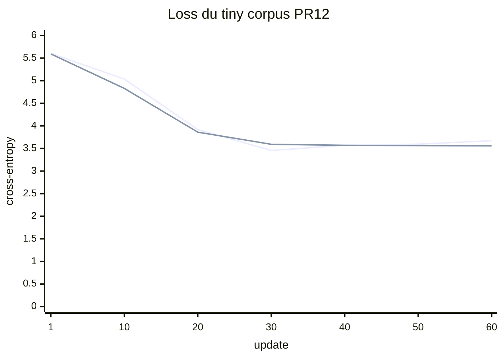

# Laboratoire PR12 - Premier run de corpus mesuré

Date : 2026-08-30<br>
Branche : `feature/pr12-evaluation-tiny-corpus`

## Hypothèse

Un tiny decoder de 16 dimensions entraîné 60 updates sur les petites histoires PR12 devrait réduire nettement validation loss et perplexité. Il ne devrait pas encore produire du français cohérent avec seulement environ 1 000 tokens train.

La variable temporelle principale est le nombre d'updates. Architecture, tokenizer, fichiers, seed, prompts et split restent fixes.

## 1. Vérifier le projet

```powershell
.\gradlew.bat test
```

Tous les tests doivent terminer par `BUILD SUCCESSFUL`.

## 2. Entraîner le tokenizer sur train seulement

```powershell
.\gradlew.bat run --args="tokenizer bpe train --input docs/lab-notes/samples/pr12-train.txt --vocab-size 272 --output build/labs/pr12/tokenizer.json"
```

Résultat de référence :

```text
Corpus bytes:       1321
Corpus SHA-256:     a3ed0d2bc70a809fa913e822d6a071a7509ce827530ec09fe87c044578f58ff6
Vocabulary size:    272
Learned merges:     13
```

Ne jamais remplacer l'entrée par la concaténation train + validation. Les merges verraient alors les données réservées à l'évaluation.

## 3. Lancer un run frais

```powershell
$runDir = "build/labs/pr12/demo-$(Get-Date -Format yyyyMMdd-HHmmss)"
.\gradlew.bat run --args="train corpus --config configs/lab-pr12-tiny-corpus.yaml --tokenizer build/labs/pr12/tokenizer.json --train-corpus docs/lab-notes/samples/pr12-train.txt --validation-corpus docs/lab-notes/samples/pr12-validation.txt --run-dir $runDir --updates 60 --eval-every 10 --checkpoint-every 20 --shuffle-buffer 32 --prompt Lina --prompt Milo --sample-tokens 12"
```

Chaque exécution demande un nouveau dossier. La commande refuse d'écraser un run existant.

## Provenance du run officiel

| Artifact | SHA-256 |
|---|---|
| Train | `a3ed0d2bc70a809fa913e822d6a071a7509ce827530ec09fe87c044578f58ff6` |
| Validation | `a5cc40cf36a0322c3de554b784c90b852e3eb827f9aca2d8d94fb35546fee583` |
| Tokenizer | `9e9e67049b1319fe909c6ec6584210c1f86d8fb86085c55cc95c85585f960f6d` |
| Config | `94af40a27d00ca4e393d143d8a3ab5a9cb49c2ff057a07f959fe42a6c40d4fc6` |

- moteur : PyTorch `2.7.1` via DJL `0.36`;
- device : CPU;
- seed : `42`;
- train : `1 031` tokens, `64` fenêtres;
- validation : `260` tokens, `16` fenêtres;
- batch : `4 x 16 = 64` positions au maximum;
- checkpoints : updates `20`, `40`, `60`.

## Résultats observés

| Update | Époque | Train loss | Validation loss | Perplexité validation | Débit cumulatif tokens/s |
|---:|---:|---:|---:|---:|---:|
| 1 | 1 | 5,6022 | 5,5920 | 268,28 | 707 |
| 10 | 1 | 5,0359 | 4,8291 | 125,10 | 3 214 |
| 20 | 2 | 3,9179 | 3,8605 | 47,49 | 4 134 |
| 30 | 2 | 3,4558 | 3,5924 | 36,32 | 4 909 |
| 40 | 3 | 3,5697 | 3,5700 | 35,52 | 5 301 |
| 50 | 4 | 3,5959 | 3,5630 | 35,27 | 5 546 |
| 60 | 4 | 3,6715 | 3,5578 | 35,09 | 5 898 |



La validation s'améliore fortement, puis plafonne près de `3,56`. La train loss remonte légèrement après son minimum observé à l'update 30; avec si peu de fenêtres et un shuffle par époque, une update isolée est bruyante.

## 4. Comparer les checkpoints

```powershell
.\gradlew.bat run --args="evaluate --run-dir $runDir --validation-corpus docs/lab-notes/samples/pr12-validation.txt --checkpoint step-00000020 --checkpoint step-00000040 --checkpoint step-00000060"
```

Sortie de référence :

```text
checkpoint       update       loss perplexity
step-00000020        20   3.860452    47.4868
step-00000040        40   3.570009    35.5169
step-00000060        60   3.557820    35.0866
Gradients computed: false
```

Les valeurs rechargées correspondent aux métriques enregistrées pendant le run. Les tokens/s propres à cette commande varient avec le warmup et ne servent pas à choisir le meilleur checkpoint.

## 5. Inspecter les samples fixes

```powershell
Get-Content "$runDir/samples/step-00000001.txt"
Get-Content "$runDir/samples/step-00000020.txt"
Get-Content "$runDir/samples/step-00000060.txt"
```

Observation :

```text
update 1  : bytes invalides UTF-8, IDs conservés
update 20 : "Linae    ee    e" et "Milo            "
update 60 : "Linarrrrrrrrrrrr" et "Milorrrrrrrrrrrr"
```

La validité UTF-8 progresse, mais la répétition greedy montre que le modèle n'a pas appris une distribution linguistique suffisante.

## 6. Vérifier les artifacts

```powershell
Get-Content "$runDir/run-metadata.json"
Get-Content "$runDir/experiment.json"
Get-Content "$runDir/metrics.jsonl" | Select-Object -First 1
Get-Content "$runDir/metrics.jsonl" | Select-Object -Last 1
```

`run-metadata.json` doit contenir les trois checksums de données/tokenizer. `experiment.json` doit contenir les cadences, prompts et comptes de fenêtres. Chaque ligne de `metrics.jsonl` représente une update.

## 7. Prouver le refus d'un autre dataset

Copier validation, modifier un caractère, puis tenter :

```powershell
Copy-Item docs/lab-notes/samples/pr12-validation.txt build/labs/pr12/validation-modified.txt
Add-Content build/labs/pr12/validation-modified.txt "modification"
.\gradlew.bat run --args="evaluate --run-dir $runDir --validation-corpus build/labs/pr12/validation-modified.txt"
```

La commande doit refuser le checksum avant le forward.

## Questions et réponses

### Pourquoi séparer les fichiers avant d'entraîner le BPE?

Les merges BPE sont des paramètres appris à partir des fréquences du texte. Si la validation participe à ces fréquences, elle influence déjà le pipeline, même si ses tokens ne produisent jamais de gradient du Transformer.

### Pourquoi pondérer la loss par token?

Le dernier batch peut contenir moins de lignes. Pondérer par son nombre réel de positions empêche ce petit batch de peser autant qu'un batch complet.

### La perplexité 35 signifie-t-elle 35 mots possibles?

Non. Elle décrit l'incertitude moyenne sur les tokens de ce tokenizer précis. Un token peut être un byte ou une fusion de plusieurs bytes; ce n'est pas nécessairement un mot.

### Pourquoi les tokens/s augmentent-ils pendant le run?

La JVM, DJL et PyTorch réchauffent leurs chemins d'exécution. De plus, le débit affiché est cumulatif : le coût fixe du démarrage devient proportionnellement plus petit. Ce lab n'est pas un benchmark matériel stable.

### Pourquoi choisir le checkpoint 60 si les samples restent mauvais?

Le checkpoint 60 est le meilleur des trois selon validation loss, avec un gain faible face à 40. Il est utile comme état mesuré, mais pas comme modèle publiable. « Meilleur de ce run » ne signifie pas « assez bon ».

### Peut-on maintenant lancer `mini-17m`?

Non. Les métriques prouvent que le pipeline apprend et évalue sans fuite, mais le corpus est minuscule, les samples sont répétitifs et aucun profil mémoire 17 M n'a encore été réalisé. La prochaine expérience doit augmenter progressivement corpus et modèle, une variable à la fois.

## Décision

**Ne pas lancer le long run 17 M.** Conserver PR12 comme baseline exécutable. La prochaine porte consiste à obtenir des samples cohérents sur un corpus sous licence plus grand avec validation qui continue de progresser, puis mesurer mémoire et débit d'un preset intermédiaire.
