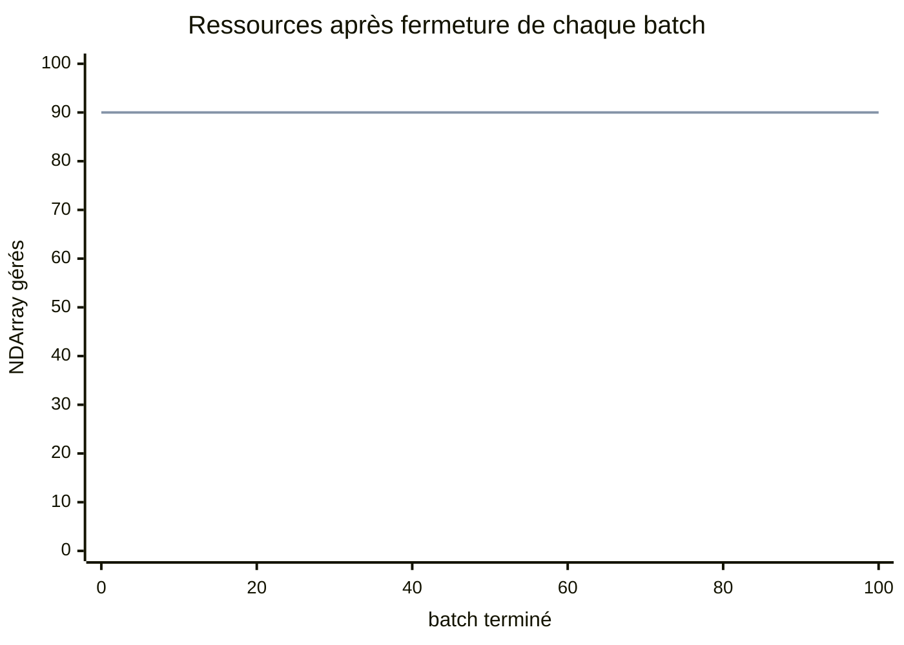

# Correctif avant PR13 - Lifetime des NDManager

Date : 2026-08-30  
Branche : `fix/pr13-djl-manager-lifetime`

## Hypothèse

Le crash natif après plusieurs validations vient de temporaires attachés au manager des paramètres. Si l'embedding et la projection liée donnent explicitement l'ownership au batch, fermer chaque sous-manager doit produire un nombre de ressources stable et permettre au 17,3 M de dépasser 20 batches.

## Reproduction avant correction

Le preset `configs/diagnostic-17m-b16-t256.yaml` conserve exactement `17 308 032` paramètres avec `vocabSize=512` et `ffnDim=1344`. Cette allocation diffère de `mini-17m.yaml`, mais garde la même taille totale et rend le BPE pédagogique praticable.

Avec `B=16`, `T=256` et `maxValidationBatches=20`, le run précédent s'arrêtait avant sa première ligne `update=...`; `metrics.jsonl` restait vide et la JVM rapportait un crash dans `c10.dll`.

## 1. Exécuter les tests de régression

```powershell
.\gradlew.bat test --tests "io.github.lxptechnologies.lxpmini.model.TokenEmbeddingTest" --tests "io.github.lxptechnologies.lxpmini.evaluation.LanguageModelEvaluatorTest" --tests "io.github.lxptechnologies.lxpmini.training.LanguageModelTrainerTest"
```

Le test d'ownership vérifie les trois managers. Le soak test réalise 128 évaluations avec un manager modèle capé et exige 129 snapshots identiques. La boucle d'entraînement vérifie aussi que les ressources atteignent un plateau après la première création des états Adam.

## 2. Refaire le diagnostic de 20 batches

Les dossiers `data/`, `artifacts/` et `runs/` sont locaux et ignorés par Git. Préparer TinyStories et le tokenizer BPE-512 avec le script du projet si ces artefacts n'existent pas.

```powershell
.\scripts\train-tinystories.ps1 -Language en -PrepareData -Updates 2 -EvalEvery 100 -CheckpointEvery 100 -MaxValidationBatches 1 -SampleTokens 1
```

Cette commande prépare les fichiers puis effectue aussi un court sanity run. Le tokenizer est appris sur le fichier train seulement; le diagnostic ci-dessous réutilise ensuite exactement ces artifacts.

```powershell
$runDir = "build/labs/pr13-fix/val20-$(Get-Date -Format yyyyMMdd-HHmmss)"
.\gradlew.bat run --args="train corpus --config configs/diagnostic-17m-b16-t256.yaml --tokenizer artifacts/tokenizers/tinystories-en/bpe-512.json --train-corpus data/prepared/tinystories-en/train.txt --validation-corpus data/prepared/tinystories-en/validation.txt --run-dir $runDir --updates 2 --eval-every 100 --checkpoint-every 100 --shuffle-buffer 32 --max-validation-batches 20 --trace-evaluation-resources --prompt Lily --sample-tokens 1"
```

Résultat officiel :

| Évaluation | Snapshots | Arrays gérés | Validation loss | Résultat |
|---:|---:|---:|---:|---|
| après update 1 | `0..20` | `90` constant | `6,200254` | succès |
| après update 2 | `0..20` | `90` constant | `6,187696` | succès + checkpoint |

Une première version du correctif produisait `386`, puis `682`. Le delta de `296` a révélé un second défaut : les quatre parcours des 74 gradients recréaient chacun un wrapper DJL par update. Après acquisition unique et fermeture en `finally`, les deux évaluations restent au même niveau de `90`.

## 3. Prolonger à 100 batches

```powershell
$runDir = "build/labs/pr13-fix/val100-$(Get-Date -Format yyyyMMdd-HHmmss)"
.\gradlew.bat run --args="train corpus --config configs/diagnostic-17m-b16-t256.yaml --tokenizer artifacts/tokenizers/tinystories-en/bpe-512.json --train-corpus data/prepared/tinystories-en/train.txt --validation-corpus data/prepared/tinystories-en/validation.txt --run-dir $runDir --updates 2 --eval-every 100 --checkpoint-every 100 --shuffle-buffer 32 --max-validation-batches 100 --trace-evaluation-resources --prompt Lily --sample-tokens 1"
```

Résultat officiel :

| Évaluation | Snapshots | Arrays gérés | Validation loss | Durée totale |
|---:|---:|---:|---:|---:|
| après update 1 | `0..100` | `90` constant | `6,202695` | |
| après update 2 | `0..100` | `90` constant | `6,190223` | `2 min 25 s` |



## Questions et réponses

### Pourquoi le garbage collector Java ne corrige-t-il pas ce problème?

Les objets Java ne représentent qu'une poignée vers les tenseurs PyTorch natifs. `NDManager.close()` fournit une frontière déterministe; attendre la pression heap ou appeler `System.gc()` ne garantit ni le moment ni l'ordre de libération natif.

### Pourquoi `cap()` est-il utile?

Il interdit toute nouvelle ressource dans le manager modèle après son initialisation. L'ancien embedding échouait immédiatement à la première indexation, ce qui localisait la mauvaise chaîne d'ownership sans attendre un crash natif.

### Pourquoi une série plate est-elle plus importante que « aucun crash »?

Une fuite lente peut survivre à 20 ou 100 batches selon la machine. Le compteur stable prouve qu'après chaque `batchManager.close()`, aucun `NDArray` transient n'est resté attaché à la durée de vie du modèle.

### Les nombres 386 et 682 sont-ils universels?

Non. Ils dépendent de l'architecture, du moteur et des ressources persistantes déjà matérialisées. L'invariant est la pente nulle à l'intérieur d'une phase, pas la valeur absolue.

## Décision

Le défaut d'ownership est corrigé et le diagnostic réel franchit 20 puis 100 batches. Ce correctif s'arrête ici : la matrice d'expériences PR13 doit repartir ensuite d'une branche propre et conserver ces tests comme garde-fou.
