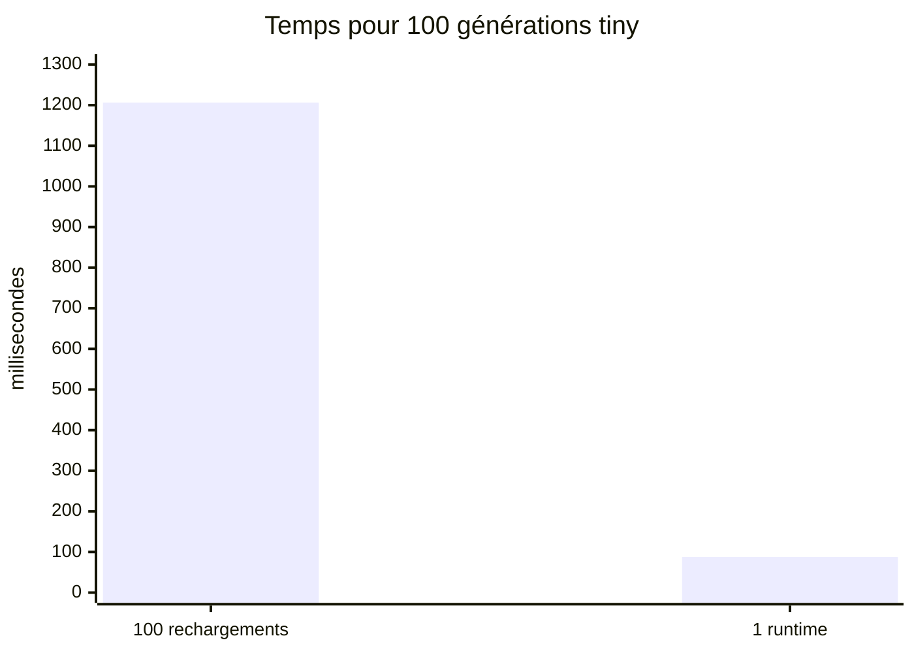

# PR14 - Charger une fois, générer plusieurs fois

Date : 2026-08-30  
Branche : `feature/pr14-inference-runtime`

## Hypothèse

Si le modèle et son checkpoint restent chargés, 100 requêtes doivent produire exactement les mêmes tokens que 100 cycles de chargement, tout en supprimant presque tout le coût de reconstruction. Après chaque requête, le nombre de ressources durables doit revenir au même niveau.

## 1. Vérifier les contrats automatisés

```powershell
.\gradlew.bat test --tests "io.github.lxptechnologies.lxpmini.inference.InferenceRuntimeTest" --tests "io.github.lxptechnologies.lxpmini.cli.InferenceCommandsTest"
```

Ces tests couvrent l'équivalence avec le pipeline PR11, 100 requêtes successives, 12 appels provenant de quatre threads, la stabilité des ressources, le fonctionnement sans relire les artefacts et la fermeture idempotente.

## 2. Préparer un modèle tiny lisible

Utilise un nouveau dossier si `demo-001` existe déjà, car les runs PR10 ne sont jamais écrasés.

```powershell
.\gradlew.bat run --args="tokenizer byte create --output build/labs/pr14/tokenizer.json"
.\gradlew.bat run --args="train checkpoint-demo --config configs/lab-pr09-tiny.yaml --run-dir build/labs/pr14/demo-001 --before-updates 80 --after-updates 1"
```

Ce modèle de `6 752` paramètres mémorise le motif synthétique `abc `. Il sert à vérifier le runtime, pas à estimer la qualité du futur 17 M.

## 3. Réutiliser le runtime

```powershell
.\gradlew.bat run --args="inference complete --model-id lxp-mini-pr14-tiny-base --run-dir build/labs/pr14/demo-001 --tokenizer build/labs/pr14/tokenizer.json --prompt abc --requests 3 --max-new-tokens 12 --strategy greedy"
```

Résultat de référence :

```text
Model ID:             lxp-mini-pr14-tiny-base
Model kind:           base
Checkpoint:           step-00000081
Parameters:           6752
Concurrency:          serialized
Loaded once:          true
Request 1:            " abc ababc a"
Request 2:            " abc ababc a"
Request 3:            " abc ababc a"
Completed requests:   3
Managed arrays stable: true
Runtime closed:       true
```

## 4. Comparer 100 requêtes

```powershell
.\gradlew.bat run --args="inference benchmark --model-id lxp-mini-pr14-tiny-base --run-dir build/labs/pr14/demo-001 --tokenizer build/labs/pr14/tokenizer.json --prompt abc --requests 100 --max-new-tokens 1"
```

Mesure locale officielle de PR14 :

| Cycle de vie | Requêtes | Chargements | Temps |
|---|---:|---:|---:|
| recharger à chaque requête | 100 | 100 | `1 206,26 ms` |
| réutiliser un runtime | 100 | 1 | `87,55 ms` |

Le ratio observé vaut `13,78x`. Les sorties sont identiques et `Managed arrays stable: true`.



Ce ratio dépend fortement du disque, du moteur déjà initialisé, du modèle, du contexte et du nombre de tokens. Il prouve que le cycle de vie compte; il ne prédit pas la latence du 17 M ni le gain du futur cache KV.

## Questions et réponses

### Pourquoi le benchmark génère-t-il seulement un token?

Pour rendre le coût de chargement visible. Avec beaucoup de tokens, le recalcul autoregressif sans cache KV dominerait les deux scénarios et mesurerait surtout une limite de PR15.

### Est-ce vraiment la CLI historique PR11?

Le scénario legacy reproduit son cycle de vie : nouveau loader, nouveau modèle, lecture et fermeture pour chaque requête. Le prompt est tokenisé une fois hors chronomètre et les deux scénarios comparent les IDs, afin qu'un dernier byte UTF-8 incomplet ne fausse pas la mesure. Le test automatisé conserve en plus une implémentation indépendante du pipeline PR11 comme oracle token par token.

### Pourquoi `SERIALIZED` si plusieurs threads sont acceptés?

Les threads peuvent appeler simultanément, mais un verrou équitable ordonne les générations. Nous obtenons une limite explicite et sûre sans dupliquer les poids. Une politique plus parallèle devra annoncer son budget mémoire et prouver son isolation.

### Pourquoi garder `generate()` si `complete()` est plus pratique?

Les IDs permettent les tests numériques et le diagnostic d'une séquence byte UTF-8 incomplète. `complete()` est un adaptateur texte; `generate()` reste le contrat fondamental.

### Le modèle base est-il maintenant un chatbot?

Non. Il complète du texte selon son préentraînement. Les rôles, le chat template et le SFT appartiennent aux PR suivantes.

## Décision

Le runtime réutilisable satisfait la porte PR14 : un seul chargement, résultats PR11 conservés, scopes de requête fermés, concurrence bornée et aucune connaissance HTTP dans le coeur. PR15 peut maintenant isoler le cache KV.
