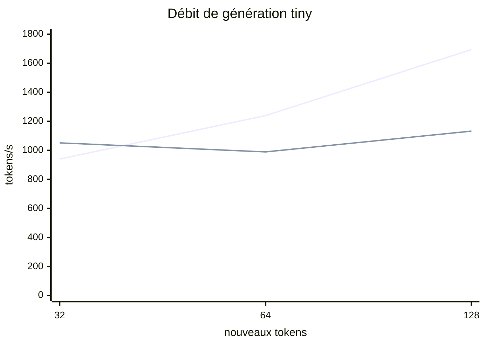

# PR15 - Mesurer le cache KV

Date : 2026-08-30  
Branche : `feature/pr15-kv-cache-context`

## Hypothèse

Le cache doit produire les mêmes logits et tokens que le recalcul complet, isoler chaque requête et réduire fortement les tokens traités. Sur un modèle minuscule, son coût fixe peut toutefois retarder le gain de débit.

## 1. Exécuter les tests

```powershell
.\gradlew.bat test --tests "io.github.lxptechnologies.lxpmini.model.KeyValueCacheTest" --tests "io.github.lxptechnologies.lxpmini.inference.InferenceRuntimeTest" --tests "io.github.lxptechnologies.lxpmini.cli.InferenceCommandsTest"
```

Les tests vérifient une tolérance absolue de logits `1e-5`, deux caches intercalés, fermeture indépendante, sorties cached/non-cached, invalidation, troncature mesurée et rejet avant calcul.

## 2. Préparer le tiny contexte 256

Utilise un run horodaté et conserve la même session PowerShell :

```powershell
$labId = Get-Date -Format yyyyMMdd-HHmmss
$runDir = "build/labs/pr15/demo-$labId"
$tokenizerPath = "build/labs/pr15/tokenizer-$labId.json"
.\gradlew.bat run --args="tokenizer byte create --output $tokenizerPath"
.\gradlew.bat run --args="train checkpoint-demo --config configs/lab-pr15-kv-cache.yaml --run-dir $runDir --before-updates 80 --after-updates 1"
```

Le preset conserve `6 752` paramètres, mais porte `contextLength` de 8 à 256. RoPE n'ajoute aucun poids; le calcul et ses caches augmentent.

## 3. Comparer 32, 64 et 128 tokens

```powershell
.\gradlew.bat run --args="inference cache-benchmark --model-id lxp-mini-pr15-tiny-base --run-dir $runDir --tokenizer $tokenizerPath --prompt abc --new-token-counts 32,64,128 --iterations 3"
```

Mesure officielle locale :

| Nouveaux tokens | Cache tokens/s | Recalcul tokens/s | Accélération | Tokens modèle cache | Tokens modèle recalcul | Sorties |
|---:|---:|---:|---:|---:|---:|---|
| 32 | `940,24` | `1 051,50` | `0,89x` | 34 | 592 | identiques |
| 64 | `1 239,14` | `989,34` | `1,25x` | 66 | 2 208 | identiques |
| 128 | `1 694,11` | `1 132,28` | `1,50x` | 130 | 8 512 | identiques |



Les chiffres dépendent de la machine et d'un échantillon de trois itérations après warmup. Le fait robuste est la réduction du travail; le gain temporel doit toujours être remesuré sur le modèle et le contexte cibles.

## 4. Observer les politiques de contexte

Le mode strict refuse `254 + 3 > 256` avant le forward :

```powershell
$longPrompt = "a" * 254
.\gradlew.bat run --args="inference complete --model-id lxp-mini-pr15-tiny-base --run-dir $runDir --tokenizer $tokenizerPath --prompt $longPrompt --max-new-tokens 3 --context-policy reject"
```

La commande doit afficher `Inference error` et Gradle rapporte alors un code de sortie `2`. C'est un rejet attendu, avant tout forward.

Pour comparer ponctuellement le recalcul complet :

```powershell
.\gradlew.bat run --args="inference complete --model-id lxp-mini-pr15-tiny-base --run-dir $runDir --tokenizer $tokenizerPath --prompt abc --max-new-tokens 32 --no-kv-cache --context-policy reject"
```

## Questions et réponses

### Pourquoi 32 tokens sont-ils plus lents avec cache?

Le modèle de 6 752 paramètres rend un forward complet très bon marché. Les concaténations K/V, scopes DJL et petits kernels coûtent davantage que le calcul économisé au début. À 64 puis 128 tokens, la croissance quadratique du recalcul domine.

### Pourquoi les tokens/s cached augmentent-ils avec la longueur?

Le prefill fixe de trois tokens et le warmup sont amortis sur davantage de tokens générés. Cela ne signifie pas qu'une séquence infinie devient toujours plus rapide; la taille croissante de l'attention et la mémoire finissent par dominer.

### Pourquoi invalider tout le cache au lieu de retirer un token?

Parce que la baseline PR11 remet les positions RoPE de la fenêtre à `0..T-1`. Les K/V restants portent leurs anciennes rotations. Refaire le prefill garantit l'équivalence; une autre politique devra être explicitement conçue et évaluée.

### Le cache peut-il passer d'une requête à l'autre?

Non. C'est un invariant de sécurité et de correction. Une future conversation pourra réutiliser un cache seulement dans un objet de session explicite avec identité, invalidation et lifecycle dédiés; PR15 ne crée aucun état conversationnel caché.

## Conclusion

La porte PR15 est franchie : logits équivalents, sorties identiques, cache isolé et fermé, contexte explicite et gain mesuré plutôt que supposé. PR16 peut adapter ce runtime à HTTP sans devenir propriétaire des K/V.
