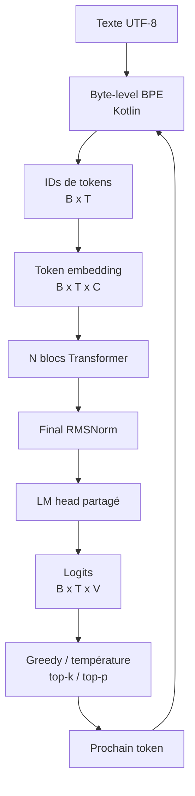
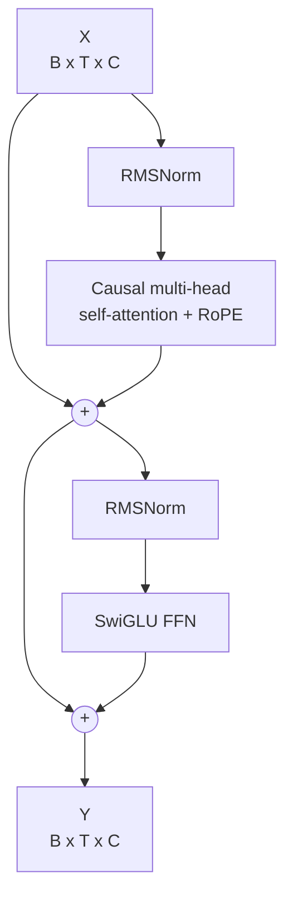
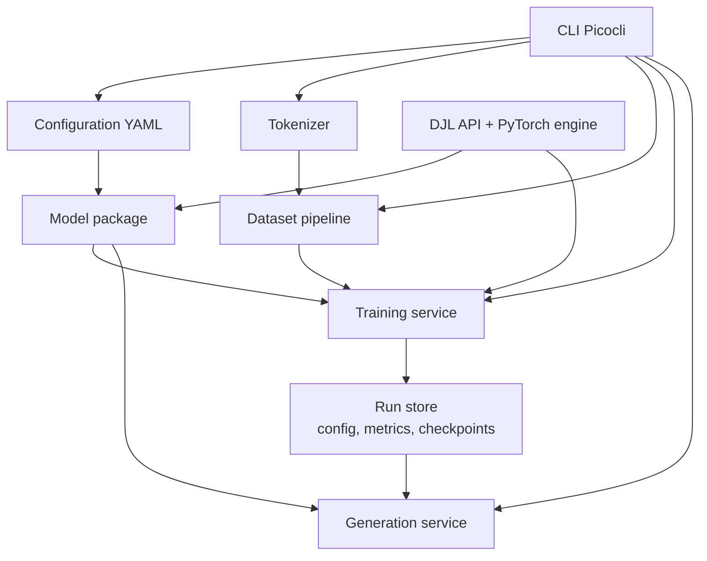

# Plan directeur de `lxp-mini-1xm`

> Statut : PR01 à PR07 terminées; PR08 implémentée sur `feature/pr08-decoder-language-model`
> Source de vérité initiale : [`docs2/project.md`](../docs2/project.md)  
> Dernière mise à jour : 2026-08-30

## 1. Intention du projet

`lxp-mini-1xm` est un projet pédagogique open source visant à construire, entraîner et exécuter localement un modèle de langage autoregressif d'environ 17 millions de paramètres.

Le résultat attendu n'est pas un concurrent des grands modèles généralistes. C'est un modèle assez petit pour être inspecté de bout en bout et assez complet pour apprendre concrètement :

- comment le texte devient des tokens;
- comment les tokens deviennent des vecteurs;
- comment l'attention causale combine l'information passée;
- comment les logits, la cross-entropy et la rétropropagation produisent un apprentissage;
- comment entraîner, évaluer, sauvegarder puis utiliser un modèle;
- quels compromis relient données, paramètres, mémoire, vitesse et qualité.

### Principe de livraison

Une PR correspond à un objectif d'apprentissage. Chaque PR doit compiler, posséder des tests significatifs, documenter les formules et les formes de tenseurs, et proposer une expérience reproductible. Nous ne construisons pas tout le Transformer dans PR01.

```mermaid
flowchart LR
    P1[PR01<br/>Fondations] --> P2[PR02<br/>Bytes]
    P2 --> P3[PR03<br/>BPE]
    P3 --> P4[PR04<br/>Dataset]
    P4 --> P5[PR05<br/>Embeddings, RMSNorm, RoPE]
    P5 --> P6[PR06<br/>Attention causale]
    P6 --> P7[PR07<br/>Bloc Transformer]
    P7 --> P8[PR08<br/>Modèle complet]
    P8 --> P9[PR09<br/>Loss et entraînement]
    P9 --> P10[PR10<br/>Checkpoints]
    P10 --> P11[PR11<br/>Génération]
    P11 --> P12[PR12<br/>Évaluation]
    P12 --> P13[PR13<br/>Expériences d'échelle]
```



## 2. Périmètre

### Inclus

- Kotlin/JVM, JDK 25 et Gradle Kotlin DSL;
- byte tokenizer puis byte-level BPE écrits en Kotlin;
- Transformer decoder-only écrit explicitement en Kotlin;
- DJL pour les tenseurs, l'autograd, les appareils et le backend PyTorch;
- apprentissage next-token, AdamW, warmup, cosine decay et gradient accumulation;
- entraînement CPU et GPU local lorsque le backend le permet;
- CLI, tests, checkpoints, métriques, génération et documentation pédagogique.

### Exclus de la première trajectoire

- modèle préentraîné, Hugging Face Transformers ou Transformer DJL préfabriqué;
- GQA, MoE, Flash Attention custom, entraînement distribué;
- quantification, LoRA, RLHF, instruction tuning;
- serveur HTTP, interface Web et déploiement en production;
- promesse de conversation, de factualité ou de raisonnement comparable à un grand LLM.

Ces exclusions protègent la lisibilité. Elles pourront devenir des expériences après PR13, jamais des dépendances cachées du parcours principal.

## 3. Architecture cible

### 3.1 Vue fonctionnelle



Notation : `B` = batch, `T` = longueur de séquence, `C` = `dModel`, `V` = taille du vocabulaire, `H` = nombre de têtes et `D = C / H`.

### 3.2 Un bloc Transformer

L'architecture retenue est pre-norm : la normalisation précède chaque sous-couche et la connexion résiduelle contourne cette sous-couche.



Dans l'attention :

```text
X [B,T,C]
 -> Q,K,V [B,T,C]
 -> têtes [B,H,T,D]
 -> scores QK^T / sqrt(D) [B,H,T,T]
 -> masque causal + softmax
 -> valeurs agrégées [B,H,T,D]
 -> fusion [B,T,C]
```

RoPE est appliqué à `Q` et `K`, n'ajoute pas de poids appris et encode la position par rotations sinusoïdales. Le masque causal interdit à la position `t` de lire les positions futures.

### 3.3 Composants logiciels visés



Les dépendances vont vers le coeur, jamais vers la CLI. Les objets de configuration et le calcul théorique des paramètres ne dépendent pas de DJL. Ce découplage permet de tester PR01 sans télécharger de bibliothèque native PyTorch.

## 4. Arborescence proposée

PR01 crée uniquement les éléments nécessaires aux fondations. Les dossiers marqués « futur » apparaîtront dans la PR qui les utilise, pas sous forme de classes vides.

```text
lxp-mini-1xm/
├── .github/workflows/ci.yml
├── configs/
│   ├── mini-11m.yaml
│   ├── mini-14m.yaml
│   ├── mini-17m.yaml
│   └── mini-22m.yaml
├── docs/
│   ├── README.md
│   ├── plan-directeur.md
│   ├── 00-project-goals.md
│   ├── architecture/
│   │   ├── overview.md
│   │   ├── parameter-counting.md
│   │   ├── djl-memory-management.md       # futur, avant entraînement
│   │   └── decisions/
│   ├── experiments/                       # futur, à la première expérience
│   └── lab-notes/
│       └── pr-01-project-foundation.md
├── gradle/wrapper/
├── src/
│   ├── main/kotlin/io/github/lxptechnologies/lxpmini/
│   │   ├── cli/
│   │   └── config/
│   └── test/kotlin/io/github/lxptechnologies/lxpmini/
│       └── config/
├── .gitignore
├── build.gradle.kts
├── gradle.properties
├── gradlew
├── gradlew.bat
├── settings.gradle.kts
└── LICENSE
```

Arborescence logique future sous `io.github.lxptechnologies.lxpmini` :

```text
tokenizer/   # PR02-03
data/        # PR04
model/       # PR05-08
training/    # PR09-10
generation/  # PR11
evaluation/  # PR12
```

## 5. Outils et dépendances minimales

### 5.1 Outils

| Outil | Usage | Décision |
|---|---|---|
| JDK 25 | compilation et exécution | imposé par le projet |
| Gradle Wrapper 9.1.0 | build reproductible avec Java 25 | validé en PR01 |
| Kotlin/JVM 2.3.0 | toute la logique applicative | validé avec la cible JVM 25 en PR01 |
| JUnit 5 | tests | oui dès PR01 |
| GitHub Actions | CI sur build et tests | oui dès PR01 |
| NVIDIA GPU + pilotes compatibles | accélération facultative | recommandé pour le 17 M, non requis pour les tests |

Gradle supporte officiellement Java 25 à partir de 9.1.0. La version du wrapper devra donc être au moins 9.1 et rester verrouillée dans le dépôt ([matrice de compatibilité Gradle](https://docs.gradle.org/current/userguide/compatibility.html)).

### 5.2 Dépendances applicatives

| Dépendance | À partir de | Pourquoi |
|---|---:|---|
| Jackson Kotlin + YAML | PR01 | charger strictement les presets YAML |
| Picocli | PR01 | CLI explicite, sous-commandes et erreurs lisibles |
| DJL BOM | PR05 | aligner toutes les versions DJL |
| `ai.djl:api` | PR05 | NDArray, Block, Parameter, Device, autograd |
| `ai.djl.pytorch:pytorch-engine` | PR05 | backend numérique PyTorch |
| SLF4J simple ou Logback | PR01/PR09 | logs CLI puis métriques d'entraînement |

PR05 a vérifié et verrouillé le BOM DJL `0.36.0`, `ai.djl:api` et `pytorch-engine`. Le moteur PyTorch télécharge automatiquement les bibliothèques natives adaptées au premier lancement; les environnements hors ligne devront ajouter les artefacts natifs correspondant explicitement à leur plateforme ([BOM DJL](https://docs.djl.ai/master/bom/index.html), [moteur PyTorch DJL](https://djl.ai/engines/pytorch/pytorch-engine/)).

### 5.3 Pourquoi ne pas ajouter davantage

- Pas de framework d'injection : le graphe d'objets est petit.
- Pas de framework Web : aucune API réseau n'est requise.
- Pas de bibliothèque de tokenizer : le tokenizer est un sujet d'apprentissage.
- Pas de bibliothèque Transformer : elle masquerait précisément ce que le projet enseigne.
- Pas de Python dans le pipeline principal : les mêmes commandes Kotlin couvrent tokenization, entraînement et génération.

## 6. Preset `mini-17m` et nombre de paramètres

Configuration de référence :

```yaml
model:
  vocabSize: 8192
  contextLength: 256
  dModel: 384
  numLayers: 8
  numHeads: 6
  ffnDim: 1024
  ropeTheta: 10000.0
  dropout: 0.0
  tieEmbeddings: true
```

Donc `headDim = 384 / 6 = 64`.

### 6.1 Hypothèses qui rendent le calcul exact

- les projections linéaires n'ont pas de biais;
- chaque bloc possède deux RMSNorm avec un vecteur appris de taille `dModel`;
- SwiGLU possède trois matrices : gate, value et projection de sortie;
- RoPE et le masque causal n'ont aucun paramètre appris;
- le LM head réutilise la matrice des embeddings;
- un RMSNorm final est présent;
- aucun embedding positionnel appris n'est ajouté.

### 6.2 Calcul

| Composant              |                        Formule |      Paramètres |
|------------------------|-------------------------------:|----------------:|
| Token embeddings       |                        `V × C` |       3 145 728 |
| Attention d'un bloc    |                       `4 × C²` |         589 824 |
| SwiGLU d'un bloc       |                    `3 × C × F` |       1 179 648 |
| Deux RMSNorm d'un bloc |                        `2 × C` |             768 |
| Un bloc                |               somme précédente |       1 770 240 |
| Huit blocs             |                `8 × 1 770 240` |      14 161 920 |
| RMSNorm final          |                            `C` |             384 |
| LM head                |        partagé avec embeddings |   0 additionnel |
| **Total**              | `V×C + N×(4C² + 3CF + 2C) + C` |  **17 308 032** |

Le contexte de 256 tokens et les 6 têtes modifient le calcul et la mémoire d'exécution, mais pas le nombre de poids dans cette architecture. En revanche, augmenter `vocabSize`, `dModel`, `ffnDim` ou `numLayers` augmente directement les paramètres.

Si le partage de poids est désactivé, le LM head ajoute `C × V = 3 145 728` poids et porte le total à `20 453 760`. Si des biais sont ajoutés plus tard, le compteur et cet ADR devront être modifiés ensemble.

## 7. Décisions architecturales

### 7.1 Décidées maintenant

| Décision                           | Raison                                                | Conséquence                                               |
|------------------------------------|-------------------------------------------------------|-----------------------------------------------------------|
| Decoder-only autoregressif         | architecture minimale adaptée à la génération         | apprend uniquement le prochain token                      |
| Byte-level BPE maison              | aucun caractère UTF-8 inconnu et mécanisme observable | trainer plus lent qu'une implémentation native            |
| RoPE                               | position sans grande table apprise                    | rotation explicite de Q et K à tester                     |
| Pre-norm + RMSNorm                 | architecture moderne et simple                        | deux normalisations par bloc                              |
| Attention multi-head standard      | meilleure valeur pédagogique                          | coût quadratique en `T`                                   |
| SwiGLU                             | FFN moderne, mécanisme encore lisible                 | trois matrices par FFN                                    |
| Projections sans biais             | simplicité et compte exact de 17 308 032              | hypothèse à protéger par test                             |
| Weight tying par défaut            | économise 3 145 728 paramètres                        | embedding et head doivent partager le même poids réel     |
| Configuration YAML stricte         | expériences sans modifier le code                     | clés inconnues et valeurs invalides échouent tôt          |
| Mono-module Gradle                 | limite la structure accidentelle                      | réévaluer seulement si les frontières deviennent pénibles |
| FP32 comme référence de correction | résultats numériques faciles à comprendre             | mixed precision vient seulement après profilage           |

Chaque ligne importante devra devenir un ADR court dans `docs/architecture/decisions/` au moment de son implémentation.

### 7.2 Volontairement reportées

| Question                             |             Quand décider | Preuve nécessaire                                     |
|--------------------------------------|--------------------------:|-------------------------------------------------------|
| Mise à niveau Kotlin/Jackson/Picocli |          PR future dédiée | compatibilité, notes de version et build JDK 25 verts |
| Format JSON exact du tokenizer BPE   |                      PR03 | round-trip, merges et compatibilité de version        |
| Stratégie de lecture des gros corpus |                      PR04 | mesure mémoire et débit                               |
| Restaurabilité complète d'AdamW      |                      PR10 | test checkpoint + reprise exacte                      |
| FP16/BF16                            |                après PR12 | gain mesuré, stabilité démontrée                      |
| Dataset principal et langue          | avant le premier long run | licence, qualité, taille et objectif linguistique     |
| Budget final de tokens               |                      PR12 | courbes de validation et budget matériel              |

## 8. Plan des PR

### PR01 - Fondations et configuration

**Construire :** wrapper Gradle, projet Kotlin, CI, CLI `model info`, chargement YAML strict, `ModelConfig`, `TrainingConfig`, validation, presets et compteur théorique.

**Tests :** valeurs positives, `dModel % numHeads == 0`, clé inconnue, preset manquant, weight tying, calcul exact des quatre presets.

**Documentation/expérience :** objectifs, architecture, décision des dépendances, calcul manuel puis `model info --config configs/mini-17m.yaml`.

**Critère de sortie :** build reproductible sous JDK 25, CI verte et sortie `17 308 032`; aucun tenseur ni réseau neuronal.

### PR02 - Byte tokenizer UTF-8

**Construire :** interface de tokenizer, représentation des 256 bytes, BOS/EOS/PAD, encode/decode et sérialisation versionnée.

**Commandes exécutables :** `tokenizer byte inspect` rend visibles texte, bytes et IDs; `tokenizer byte create` écrit l'artefact JSON versionné.

**Tests :** round-trip ASCII, français, emoji, Unicode, espaces, retours à la ligne et texte vide.

**Expérience :** afficher bytes et IDs de `Bonjour Patrick 👋` et expliquer pourquoi `<unk>` est inutile.

**Critère de sortie :** tout texte UTF-8 valide fait un round-trip déterministe.

### PR03 - Byte-level BPE

**Construire :** comptage de paires, sélection déterministe, merges, vocabulaire, `tokenizer.json`, encodeur fidèle et CLI train/inspect.

**Commandes exécutables :** `tokenizer bpe train` apprend et sauvegarde les merges; `tokenizer bpe inspect` montre IDs, pièces, ratio bytes/token, vocabulaire et règles apprises.

**Tests :** premiers merges calculables à la main, égalités départagées de façon stable, sérialisation et round-trip.

**Expérience :** comparer d'abord les vocabulaires 259, 264 et 272 sur le corpus pédagogique, puis 1 024, 4 096 et 8 192 uniquement sur un corpus assez grand pour produire ces nombres de merges.

**Critère de sortie :** le même corpus et la même config produisent le même tokenizer et checksum.

### PR04 - Dataset et séquences

**Construire :** lecture de texte locale en flux, split déterministe, flux continu de tokens, fenêtres `input/target`, batching, seed et CLI d'inspection.

**Commandes exécutables :** `dataset window` expose le décalage next-token sur des IDs explicites; `dataset inspect` compte le corpus, construit les plages disjointes et affiche des batches reproductibles.

**Tests :** décalage exact d'un token, frontières, dernier segment, split sans fuite et shuffle reproductible.

**Expérience :** inspecter `[10,20,30,40] -> [20,30,40,50]`.

**Critère de sortie :** un corpus plus gros que la mémoire peut être parcouru sans créer des millions d'objets Kotlin.

### PR05 - Embeddings, RMSNorm et RoPE

**Construire :** première intégration DJL/PyTorch, table d'embeddings, RMSNorm explicite et RoPE explicite.

**Commande exécutable :** `model components` montre les formes, paramètres, rotations, gradients et la fermeture du scope natif sur CPU.

**Tests :** formes, valeur RMSNorm connue, rotation RoPE connue, gradients et fermeture correcte des `NDManager`.

**Expérience :** observer comment une position différente fait tourner le même vecteur.

**Critère de sortie :** composants isolés numériquement justes, sans bloc Transformer.

### PR06 - Self-attention causale

**Construire :** Q/K/V, séparation/fusion des têtes, score mis à l'échelle, masque causal, softmax et projection de sortie.

**Commande exécutable :** `model attention` imprime une matrice de quatre tokens, ses sommes de lignes, la plus grande probabilité future et le résultat d'une expérience anti-fuite.

**Tests :** chaque forme, somme des probabilités, masque triangulaire et test anti-fuite où modifier un token futur ne change aucun état passé.

**Expérience :** imprimer une matrice d'attention de quatre tokens.

**Critère de sortie :** propriété causale démontrée par test, pas seulement observée visuellement.

### PR07 - SwiGLU et bloc Transformer

**Construire :** gate/value/down projections, SiLU, deux résidus et assemblage pre-norm.

**Commande exécutable :** `model block` affiche chaque forme, le compte des paramètres, la causalité du bloc et une comparaison des gradients avec et sans résidus.

**Tests :** formes, propagation du gradient, causalité conservée et absence de NaN.

**Expérience :** désactiver temporairement un résidu dans un test de laboratoire et comparer le gradient.

**Critère de sortie :** un bloc isolé est correct avant répétition.

### PR08 - Modèle decoder-only

**Construire :** embeddings, N blocs, norme finale, LM head et weight tying optionnel.

**Commande exécutable :** `model forward` instancie un preset, produit les logits et compare paramètres DJL réels et compte théorique; `--untie-embeddings` ajoute une matrice indépendante.

**Tests :** logits `[B,T,V]`, compte réel contre compte théorique, partage réel des poids et forward sans NaN.

**Expérience :** comparer le compte avec et sans weight tying.

**Critère de sortie :** `mini-17m` instancie exactement les paramètres annoncés.

### PR09 - Loss et boucle d'entraînement

**Construire :** cross-entropy next-token, backward lisible, AdamW, clipping, accumulation, warmup/cosine et métriques.

**Tests :** cross-entropy connue, gradients finis, scheduler aux bornes et single-batch overfit.

**Expérience :** mémoriser un seul batch et tracer la chute de loss.

**Critère de sortie :** aucun long entraînement tant qu'un tiny model ne surapprend pas nettement un batch.

### PR10 - Checkpoints et runs reproductibles

**Construire :** arborescence de run, sauvegarde/chargement, état optimizer si supporté, checksums, métadonnées et reprise.

**Tests :** round-trip des poids, logits identiques après chargement et continuité de l'optimizer démontrée ou limitation déclarée.

**Expérience :** interrompre puis reprendre un tiny run.

**Critère de sortie :** aucune affirmation de reprise exacte sans preuve de restauration complète.

### PR11 - Génération et sampling

**Construire :** greedy, température, top-k, top-p, seed, EOS et CLI `generate`.

**Tests :** greedy connu, filtrage, somme renormalisée et génération déterministe à seed fixe.

**Expérience :** comparer quatre températures sur le même prompt.

**Critère de sortie :** le chemin logits -> token -> texte est inspectable.

### PR12 - Évaluation et premier entraînement documenté

**Construire :** validation loss, perplexité, débit, prompts fixes, comparaison de checkpoints et tiny-corpus experiment.

**Tests :** évaluation sans gradient, calcul de perplexité et séparation train/validation.

**Expérience :** premier run contrôlé, avec hypothèse, config, checksum dataset, courbes et échantillons.

**Critère de sortie :** la décision de passer au 17 M est fondée sur des sanity tests verts et des mesures.

### PR13 - Expériences d'échelle

**Construire :** matrice d'expériences 10-22 M faisant varier une seule dimension importante à la fois.

**Mesurer :** paramètres, mémoire, tokens/s, train/validation loss, qualité qualitative et contexte.

**Critère de sortie :** conclusions empiriques reproductibles, sans présenter un seul run comme une loi générale.

## 9. Comment entraîner le modèle

Les commandes ci-dessous décrivent l'interface cible. Elles ne fonctionneront qu'après la PR indiquée.

### 9.1 Préparer l'environnement

```powershell
java --version
./gradlew.bat --version
$env:DJL_DEFAULT_ENGINE = "PyTorch"
./gradlew.bat test
```

Sur Linux/macOS, utiliser `./gradlew` et `export DJL_DEFAULT_ENGINE=PyTorch`. DJL fournit un support complet de l'entraînement via son moteur PyTorch et permet de sélectionner explicitement le moteur ([documentation des moteurs DJL](https://docs.djl.ai/master/docs/engine.html)).

### 9.2 Choisir et préparer les données

Format minimal attendu : fichiers texte UTF-8 locaux, avec une séparation explicite ou déterministe entre train et validation.

```text
data/
├── raw/                 # source originale non versionnée
├── prepared/
│   ├── train.txt
│   └── validation.txt
└── DATASET.md           # provenance, licence, filtres, checksums
```

Le modèle apprend la distribution de ces données. Un corpus anglais produit surtout un modèle anglais; un objectif français exige un corpus français suffisamment propre et varié. La langue principale est donc une décision de dataset, pas une option magique de la configuration.

**Trajectoire recommandée :**

1. Quelques paragraphes dont nous possédons les droits pour tester la mémorisation.
2. Quelques Mo de texte nettoyé pour un modèle de 1 à 3 M de paramètres.
3. Un corpus éducatif sous licence vérifiée, par exemple une copie locale de TinyStories pour un objectif anglais.
4. Le preset 17 M uniquement après les trois sanity checks.

TinyStories a été conçu pour étudier de très petits modèles et les auteurs rapportent des résultats cohérents sous 10 M de paramètres; c'est un bon laboratoire anglais, pas une garantie de modèle généraliste ni français ([article TinyStories](https://arxiv.org/abs/2305.07759)). Aucun dataset ne sera téléchargé silencieusement ou commité dans Git.

**Taille requise :** il n'existe pas un nombre universel. Pour le premier vrai run 17 M, prévoir un ordre de grandeur de `100 M à 500 M` tokens vus, puis arrêter ou prolonger selon la validation loss. Ce nombre inclut les répétitions sur le corpus. Il s'agit d'un budget expérimental, pas d'une règle d'optimalité. Le document d'expérience consignera tokens uniques, tokens vus et nombre d'époques séparément.

Avant l'entraînement, vérifier :

- licence autorisant l'usage et la redistribution souhaitée;
- encodage UTF-8, taille, langue et taux de doublons;
- absence de secrets, données personnelles ou contenu indésirable évident;
- absence de chevauchement entre train, validation et prompts d'évaluation;
- checksum du fichier original et du fichier préparé;
- conservation des séparateurs de documents pour éviter les concaténations absurdes.

### 9.3 Entraîner le tokenizer après PR03

```powershell
.\gradlew.bat run --args="tokenizer bpe train --input data/prepared/train.txt --vocab-size 8192 --output artifacts/tokenizer/tokenizer.json"
.\gradlew.bat run --args="tokenizer bpe inspect --tokenizer artifacts/tokenizer/tokenizer.json --text 'Bonjour Patrick'"
```

Le tokenizer doit être entraîné sur le corpus d'entraînement seulement. Utiliser la validation pour apprendre les merges serait une fuite de données.

### 9.4 Exécuter les sanity checks après PR09

```powershell
./gradlew.bat test
./gradlew.bat run --args="train sanity-forward --config configs/tiny.yaml"
./gradlew.bat run --args="train overfit-batch --config configs/tiny.yaml --train data/prepared/train.txt --tokenizer artifacts/tokenizer/tokenizer.json"
./gradlew.bat run --args="train --config configs/tiny.yaml --tokenizer artifacts/tokenizer/tokenizer.json --train data/prepared/train.txt --validation data/prepared/validation.txt --output runs/tiny-corpus-v1"
```

Les noms précis des deux commandes de sanity check seront validés en PR09. Leurs invariants ne sont pas négociables : formes correctes et finies, loss d'un batch qui chute fortement, puis structure du tiny corpus qui commence à être apprise.

### 9.5 Lancer `mini-17m` après PR12

```powershell
./gradlew.bat run --args="model info --config configs/mini-17m.yaml"
./gradlew.bat run --args="train --config configs/mini-17m.yaml --tokenizer artifacts/tokenizer/tokenizer.json --train data/prepared/train.txt --validation data/prepared/validation.txt --output runs/mini-17m-v1"
```

Configuration de départ, à mesurer avant modification :

```yaml
training:
  batchSize: 16
  gradientAccumulationSteps: 4
  learningRate: 0.0003
  minLearningRate: 0.00003
  warmupSteps: 500
  weightDecay: 0.1
  beta1: 0.9
  beta2: 0.95
  gradientClipNorm: 1.0
  seed: 42
```

Avec un contexte de 256, le batch effectif est `16 × 4 = 64` séquences, soit `16 384` tokens par mise à jour si tous les segments sont pleins. `100 M` tokens représentent alors environ `6 104` mises à jour optimizer; `500 M`, environ `30 518`. Cette estimation doit être recalculée à partir du compteur réel de tokens, pas utilisée comme compteur d'arrêt aveugle.

### 9.6 Surveiller et reprendre

Chaque run doit produire :

```text
runs/mini-17m-v1/
├── config.yaml
├── tokenizer.json
├── checkpoints/
├── metrics.jsonl
├── samples/
└── run-metadata.json
```

Surveiller au minimum : step, tokens vus, train loss, validation loss, learning rate, gradient norm, tokens/s, temps écoulé et mémoire. Arrêter sur loss/gradient non fini. Une train loss qui baisse avec une validation loss qui remonte indique probablement du surapprentissage.

```powershell
./gradlew.bat run --args="train --resume runs/mini-17m-v1/checkpoints/latest"
./gradlew.bat run --args="generate --checkpoint runs/mini-17m-v1/checkpoints/latest --prompt 'Once upon a time' --max-new-tokens 128 --temperature 0.8 --top-k 40 --top-p 0.95"
```

La reprise ne sera déclarée exacte que si les poids, l'état AdamW, le scheduler, le step et les états aléatoires sont restaurés.

## 10. Matériel, mémoire et durée

Les poids FP32 occupent environ `17 308 032 × 4 = 69,2 MB`. Pendant AdamW, il faut aussi compter gradients, deux moments de l'optimizer, activations, buffers temporaires et mémoire native du moteur. La mémoire réelle est donc très supérieure aux seuls poids et dépend du batch, du contexte et de l'implémentation.

- CPU : suffisant pour PR01-PR11, les tests et les tiny runs; le vrai 17 M peut être très lent.
- GPU NVIDIA : chemin recommandé pour le long run; commencer avec une carte de 8 à 12 Go et réduire `batchSize` si nécessaire, sans promettre qu'une taille précise fonctionnera avant profilage.
- Disque : prévoir le corpus brut, sa version préparée, le tokenizer, plusieurs checkpoints et les caches natifs DJL.
- RAM : la pipeline PR04 doit streamer les données; elle ne doit pas supposer que tout le corpus tient dans le heap JVM.

DJL alloue des ressources natives hors du contrôle direct du garbage collector. Chaque batch et chaque sous-`NDManager` temporaire devra être fermé. La documentation DJL recommande notamment de fermer chaque `Batch` et d'utiliser `debugDump()` pour repérer un nombre de ressources croissant ([gestion mémoire DJL](https://docs.djl.ai/master/docs/development/memory_management.html)).

Il est trop tôt pour annoncer une durée d'entraînement fiable. PR12 mesurera les tokens/s sur la machine cible, puis calculera :

```text
durée estimée en secondes = budget de tokens / tokens par seconde mesurés
```

## 11. Flux d'apprentissage complet

```mermaid
flowchart LR
    RAW[Corpus local<br/>licence + checksum] --> SPLIT[Split train/validation]
    SPLIT -->|train seulement| BPE[Entraîner BPE]
    BPE --> TJSON[tokenizer.json]
    SPLIT --> ENCODE[Encoder en tokens]
    TJSON --> ENCODE
    ENCODE --> WINDOW[Fenêtres de T+1 tokens]
    WINDOW --> XY[input x<br/>target décalé y]
    XY --> FORWARD[Forward]
    FORWARD --> LOSS[Cross-entropy]
    LOSS --> BACK[Backward]
    BACK --> OPT[Clip + AdamW]
    OPT --> CKPT[Checkpoint + métriques]
    CKPT --> EVAL[Validation + échantillons]
    EVAL -->|continuer / arrêter| FORWARD
```



Pour une fenêtre `s = [s0, s1, ..., sT]` :

```text
x = [s0, s1, ..., s(T-1)]
y = [s1, s2, ..., sT]
```

Le modèle minimise la moyenne de :

```text
-log P(y[t] | x[0..t])
```

Il ne mémorise pas une réponse associée à chaque phrase. Il ajuste ses poids afin d'augmenter la probabilité du vrai prochain token dans les contextes observés.

## 12. Validation et discipline expérimentale

### Pyramide obligatoire

1. **Forward :** `[B,T] -> [B,T,V]`, aucune valeur non finie.
2. **Single-batch overfit :** un tiny model mémorise un batch.
3. **Tiny corpus :** loss train/validation et échantillons évoluent dans le bon sens.
4. **17 M :** seulement après succès documenté des trois niveaux précédents.

### Une expérience, une variable principale

Chaque fichier `docs/experiments/YYYY-MM-DD-<nom>.md` contient : hypothèse, contrôle, changement, config complète, dataset et checksum, seed, appareil, versions, tokens vus, métriques, échantillons, interprétation et conclusion.

La perplexité vaut `exp(loss)` pour une cross-entropy moyenne en logarithme naturel. Elle n'est pas directement comparable entre deux tokenizers différents, car l'unité prédite a changé.

## 13. Risques principaux

| Risque | Signal | Réduction |
|---|---|---|
| Fuite vers le futur | validation anormalement bonne | test anti-fuite en PR06 |
| Compteur de paramètres faux | estimation != modèle | comparaison théorique/réelle en PR08 |
| Fuite mémoire native | RAM/VRAM croît à chaque batch | scopes `NDManager`, fermeture et soak test |
| Dataset inadéquat | loss baisse, texte reste pauvre | audit qualité/langue, prompts fixes |
| Surapprentissage | validation remonte | checkpoints, validation régulière, arrêt raisonné |
| Reprise incomplète | trajectoire diverge après resume | tester tout l'état ou déclarer la limite |
| Non-déterminisme GPU | résultats différents à seed fixe | consigner engine/device et tolérances |
| Dépendances natives fragiles | échec au premier lancement | verrouillage, CI CPU, procédure offline |
| Ambition trop rapide | long run avant sanity checks | portes de sortie explicites par PR |

## 14. Definition of Done de PR01

PR01 a été implémentée sur la base de ce plan. Elle est terminée lorsque :

- le wrapper Gradle compatible JDK 25 fonctionne sur Windows et CI;
- `./gradlew.bat test` est vert;
- les quatre presets YAML sont strictement validés;
- les erreurs indiquent le champ et la règle enfreinte;
- `model info` explique les dimensions et le compte par composant;
- `mini-17m` affiche exactement `17 308 032` paramètres selon les hypothèses documentées;
- les tests protègent les règles et le calcul, pas seulement les getters;
- la documentation initiale et `docs/lab-notes/pr-01-project-foundation.md` existent;
- aucun tokenizer, tenseur, bloc d'attention ou entraînement n'est encore implémenté.

## 15. Questions à résoudre avant un long entraînement

Ces questions ne bloquent pas PR01 :

1. Le premier modèle utile doit-il parler principalement anglais, français, ou être volontairement bilingue?
2. Quelle machine exécutera le run 17 M : CPU, modèle de GPU et VRAM disponible?
3. Quelle licence voulons-nous pour le code, les futurs poids et le tokenizer?
4. Quel budget maximal de temps, d'électricité et de stockage acceptons-nous par expérience?
5. Voulons-nous publier les poids, ce qui impose une traçabilité stricte des licences du corpus?

## 16. Références de départ

- [Matrice de compatibilité Java de Gradle](https://docs.gradle.org/current/userguide/compatibility.html)
- [DJL : moteurs numériques](https://docs.djl.ai/master/docs/engine.html)
- [DJL : moteur PyTorch](https://djl.ai/engines/pytorch/pytorch-engine/)
- [DJL : gestion de la mémoire native](https://docs.djl.ai/master/docs/development/memory_management.html)
- [TinyStories: How Small Can Language Models Be and Still Speak Coherent English?](https://arxiv.org/abs/2305.07759)

Les versions de dépendances et les commandes marquées comme cibles devront être revérifiées dans la PR qui les introduit. Le plan explique notre direction; les tests et les notes de laboratoire établiront ce qui fonctionne réellement.
